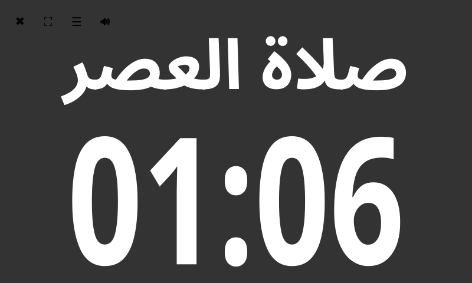
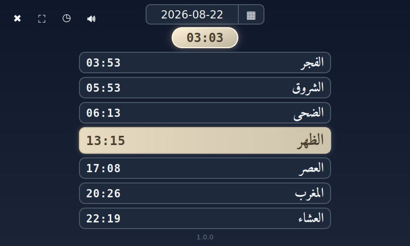
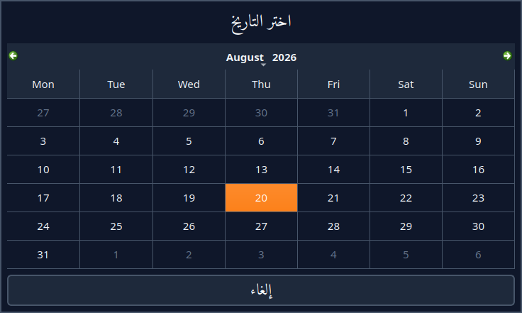
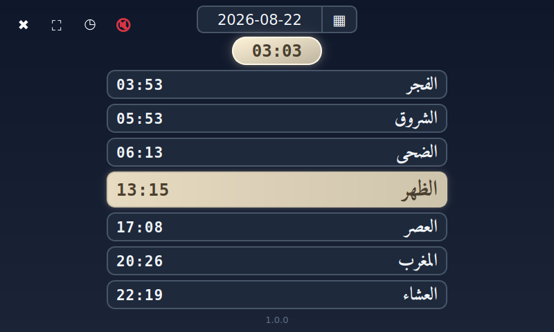
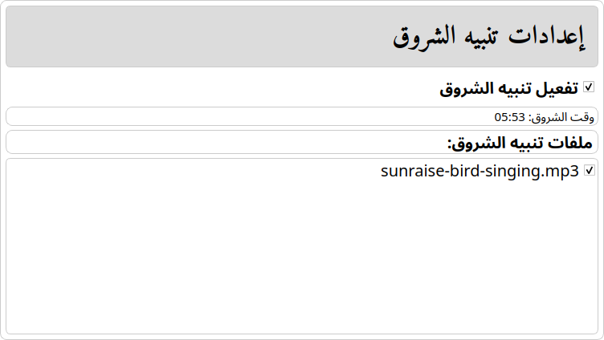

# Islamic Prayer Scheduler (Official Raspberry Pi touch screen)

This project provides an Islamic prayer time scheduler designed to run on a Raspberry Pi with a touchscreen. Follow the steps below to properly set up and run the application.

---
## Minimum Hardware Requirements

The following hardware components are required to run the Islamic Prayer Scheduler reliably:

- **Raspberry Pi 4 Model B** (minimum 1 GB RAM)
- **Official Raspberry Pi 7-inch Touchscreen Display**
- **OneNineDesign Touch Screen Case**
- **Official Raspberry Pi USB-C Power Supply** (5.1V / 3A)
- **DSI Ribbon Cable** (for connecting the touchscreen display to the Raspberry Pi)
- **SSD or SD card** (at least 32GB)
- **Bluetooth speaker**

## Prerequisites
- Internet connection
- Keyboard, mouse, and display (for initial setup)

## How to Connect the Hardware

Follow the steps below to connect the Raspberry Pi and touchscreen correctly.

1. Connect the **DSI ribbon cable** from the Raspberry Pi DSI port to the touchscreen display.
2. Ensure the ribbon cable orientation is correct and firmly seated.
3. Mount the Raspberry Pi and touchscreen into the **OneNineDesign Touch Screen Case**.
4. Connect the **official USB-C power supply** to power on the device.

It should look like the diagram below:

[Hardware Connection Diagram](assets/raspberry-pi-4-with-raspberry-7-inches-touch-screen.png)


---

## Setup Instructions

### Step 0: Raspberry Pi Basic Setup

1. Download and install the latest Raspberry Pi OS.  
2. Burn the OS image to your SSD or SD card.  
3. Attach the storage device to the Raspberry Pi.  
4. Power on the Raspberry Pi and complete the initial OS setup.  

**Additional setup:**  

- **Enable SSH:**  
  1. Click on the Raspberry Pi icon on the desktop.  
  2. Navigate to **Preferences → Raspberry Pi Configuration  → Control Centre → Interfaces**.  
  3. Click **Enable** next to **SSH**.  
  4. Click **OK** to save.  

- **Enable Executable Files:**  
  1. Open **File Manager**.  
  2. Go to **Edit → Preferences**.  
  3. Check the option **"Don't ask options on launch executable file"**.

- **Rotate the display inverted:** 
There is a bug in Rapberry pi screen and the case that it would not set properly until the screen rotated 180 degree, this bug is not resolved till I wrote this doc 
  1. Click on the Raspberry Pi icon on the desktop.  
  2. Navigate to **Preferences → Raspberry Pi Configuration  → Control Centre → Screens**.  
  3. Click **DSI-1** next to **Orientation**.  
  4. Click **inverted** to save.  

---

### Step 1: Update the System

Run the following command to update and upgrade your system packages:
```
sudo apt update && sudo apt upgrade
```

### Step 2: Clone the Repository

Run:
```
git clone <repository-url>
```
---

### Step 3: Change Directory to the Project

Run:
```
cd islamic-prayer-scheduler
```
---

### Step 4: Rename the Scheduler Directory

Run:
```
mv scheduler-official-touch-screen-with-raspberry-pi-4 scheduler
```
---

### Step 5: Copy Scheduler directory to Raspberry Desktop Dir

Run:
```
cp -r scheduler ~/Desktop/
```
or
```
scp -r scheduler <username>@<ip-address>:~/Desktop
```
---

##### Note:
If you want a sample of audio files, you can [download this file](https://www.dropbox.com/scl/fi/0xk2h8m4s69tiay82r1n4/islamic-prayer-scheduler-audio.zip?rlkey=lpryt444zxazpfflccy04n4ep&st=2fzzwisr&dl=1) and replace it with your auido directory
```
cd ~/Desktop/scheduler
mv audio audio.bak
cp islamic-prayer-scheduler-audio.zip ./
unzip islamic-prayer-scheduler-audio.zip
```

### Step 6: Add Prayer Times (CSV File)

Create a CSV file containing prayer times for your city and country using the following format:
```
Month,Day,Fajr,Sunrise,Dhuhr,Asr,Maghrib,Isha
```
Sample data:
```
Month,Day,Fajr,Sunrise,Dhuhr,Asr,Maghrib,Isha  
1,1,06:10,08:10,12:15,13:50,16:09,17:55  
1,2,06:10,08:10,12:15,13:51,16:10,17:56  
1,3,06:10,08:10,12:16,13:52,16:11,17:57  
1,4,06:10,08:10,12:16,13:53,16:12,17:58  
...
```
Once the file is ready, copy it to your Desktop using the following exact filename:
```
~/Desktop/إدخال-مواقيت-الصلاة-للمستخدم.csv
```
##### IMPORTANT: 
The filename must match exactly, including Arabic characters.

##### Note:
If you are in **Berlin**, you can use this prayer-time file for **2026**:
```
cp config/prayers-config/برلين.csv ~/Desktop/إدخال-مواقيت-الصلاة-للمستخدم.csv
```

##### Note:
This step is optional. If no file is present, `init.sh` (Step 7) creates one for you
from `config/prayers-config/برلين.csv`, and the Scheduler Settings app
can change it later at any time — see **Changing prayer times from the app** below.

---

### Step 7: Run Initialization Script

Run:
```
bash ~/Desktop/scheduler/config/scripts/init.sh
```

Run this from a terminal the first time. It asks for your password, and part of what it
does with it is install a small root helper plus a `sudoers.d` rule naming that one file
— which is what lets later releases install packages and services on their own, with
nobody present. After this, the **تثبيت مكونات النظام** icon on the Desktop re-runs setup
without asking for anything, and reports in a dialog rather than a terminal window.

---

### Step 8: Verify Cron Jobs (Check Step)

`init.sh` (Step 7) installs these for you from `~/Desktop/scheduler/config/crontab.txt`.
No manual editing is needed.

To verify:
```
crontab -l
```

The scheduler's jobs appear between these markers:
```
# >>> scheduler jobs (managed by init.sh) >>>
...
# <<< scheduler jobs (managed by init.sh) <<<
```

Re-running `init.sh` replaces that block rather than appending a second copy, so edits to
`crontab.txt` take effect on the next run. Any cron lines you add outside the markers are
left untouched.

Note: the `@reboot` Bluetooth job is installed only once
`/usr/local/bin/bt-autoconnect.sh` exists - see the Bluetooth section below.

### Step 9: Verify Scheduler Service (Check Step)

To verify that the audio event scheduler service is running correctly, run:
```
sudo systemctl status audio_event_scheduler.service
```
The service should be in an active (running) state.

The same check for the website, which serves the three screens to the LAN (see
[From a phone on the same wifi](#from-a-phone-on-the-same-wifi)):
```
sudo systemctl status scheduler_web_ui.service
```

## Step 10: Running the Prayer Time GUIs

To start the **Prayer Time Countdown GUI** and the **Scheduler Settings GUI**, simply double-click the corresponding icons on the Raspberry Pi Desktop.

Once launched, the applications should appear similar to the images shown below:


<p>
  &nbsp;&nbsp;
  
</p>
<p>
  
</p>


### The Prayer Time app

The app opens on the **countdown** view: the prayer being counted down to — `صلاة العصر`,
`صلاة المغرب` and so on — above the time remaining until it, on a background that turns
green, orange or red as that prayer approaches.

الشروق is shown on its own as `الشروق`, since it is neither a صلاة nor has an أذان. When
the next prayer falls tomorrow, a small `(غداً)` appears above the name.

<p align="center">
  
</p>

Four buttons sit in the top-left corner:

| Button | Action |
|---|---|
| ✖ | Close the app |
| ⛶ | Toggle fullscreen |
| ☰ / ◷ | Switch between the countdown and the daily prayer table |
| 🔊 / 🔇 | Mute or unmute all audio |

#### Daily prayer table

Tap **☰** for the whole day at a glance — الفجر, الشروق, الضحى, الظهر, العصر, المغرب and
العشاء — with the running period highlighted and a badge counting down the time left in it.
Times are shown on a 12-hour clock (`4:33 AM`, `7:38 PM`); the badge beside the date is
time *remaining*, so it stays `HH:MM`.

<p align="center">
  
</p>

The colours use the same 20-minute rule as the countdown view:

| Colour | Meaning |
|---|---|
| Green | the first 20 minutes after the athan |
| Red | the last 20 minutes before the next athan |
| Orange | مكروه — nafl prayer is discouraged right now |
| Beige | the rest of the period (the countdown view shows plain grey here) |

Green, red and orange are the same values the countdown view paints, so one moment does
not look like two different states depending on which screen you are looking at.

**مكروه** is shown beside the time during the three windows the countdown view also warns
about: from الشروق until الضحى opens, the zawal stretch just before الظهر, and the last 20
minutes of العصر. In all three the countdown view shows `(الوقت مكروه لصلاة النافلة)`
above the prayer name — one wording, because what is discouraged in them is nafl rather
than any one named prayer.

The last 20 minutes of العصر stay **red** on both views, not orange: المغرب really is
minutes away, and that is what the colour is for. The مكروه tag beside the time — and the
line of text on the countdown — are what say the window is makrooh.

The countdown treats الشروق → الظهر as **الضحى's own period**, matching this table: the
first 20 minutes after sunrise are الشروق on orange (مكروه), then الضحى runs to الظهر —
green for its first 20 minutes, orange again for the zawal at the end.

Tap the date to open a calendar and look at another day. The table returns to today by
itself after 10 minutes, and while left open it follows the calendar over midnight.

<p align="center">
  
</p>

#### Muting the athan

Tap **🔊** to silence every scheduled athan, athkar and Quran playback. The icon turns
into a red **🔇**, and anything playing at that moment stops immediately.

The mute lifts **by itself after one hour**, or right away if you tap the icon again.

<p align="center">
  
</p>

It works by writing the expiry time into `~/Desktop/scheduler/var/mute.flag`. The
scheduler service and the player script both read that file, so the mute still applies —
and still expires on time — even if the app is closed while it is active.

---

## Changing prayer times from the app

`~/Desktop/إدخال-مواقيت-الصلاة-للمستخدم.csv` is always the reference file the apps read.
You can edit it by hand at any time (Step 6 format), or let the **Scheduler Settings GUI**
fill it for you:

1. Open the Scheduler Settings app. The **"ملف مواقيت الصلاة الحالي"** section shows the
   reference file, when it was last updated, and which source it came from.
2. Tap **"تغيير ملف مواقيت الصلاة"** to pick a different source. The dropdown lists:
   - files found on the Desktop — including any **Al Awail** export named `<city>-<year>.csv`
     (e.g. `damascus-2026.csv`), which is converted automatically on selection;
   - or, via the browse toggle, the ready-made presets in `config/prayers-config/`.
3. If the reference file is missing or invalid when the app starts, this picker appears
   first and must be completed before the settings screen opens.

Picking a new source **overwrites** the reference file. If it may contain hand edits, the
app asks for confirmation first. Raw Al Awail exports are archived to
`config/prayers-config/raw-imports/` when imported.

## Sunrise (الشروق) notification

A short notification can be played at sunrise, separately from the five athans.

- Put the audio in `~/Desktop/scheduler/audio/shorooq/`.
- Enable or disable it in the Scheduler Settings app under **إعدادات تنبيه الشروق**, where
  you can also tick which files to play.

<p align="center">
  
</p>

With nothing ticked, every file in the folder is played — the same behaviour as the other
prayers. Sunrise never interrupts an athan that is still playing.

## Daylight saving

Many published prayer-time tables bake daylight-saving changes into fixed dates, which
are only correct for the year they were produced for. The **التوقيت الصيفي** section in
the Scheduler Settings app keeps them right automatically.

Tick **تفعيل التوقيت الصيفي** and choose your country (and city, for countries with more
than one timezone). The timezone is used **only** to decide when daylight saving starts
and ends — prayer times themselves always come from your CSV — so pick the region your
prayer times were calculated for. It is off by default, which suits regions with no
daylight saving such as Syria and Saudi Arabia.

When enabled, each time the settings are applied the app:

1. detects any daylight-saving changes already present in your file,
2. compares them with what the chosen timezone actually does this year,
3. leaves the file alone if they already match, or writes a corrected copy to
   `config/prayers-config/dst/<name>_DST_<year>.csv` if they do not.

Your original file is never modified — unticking the box reverts to it. The corrected
times feed the athan schedule and are visible in
`~/Desktop/اوقات-الصلاة-المستخدمةبالتطبيقات.csv`.

A cron entry re-runs this on 1 January, so the transition dates update themselves each
year without any manual step (see Step 8).

---

## Updates

Devices update themselves from GitHub Releases. `init.sh` installs a daily cron check at
02:00, which sits between the latest Isha and the earliest Fajr all year — and the
updater skips itself anyway while any audio is playing, so an athan is never cut off.

### What an update does and does not touch

A release only replaces the paths its own manifest names. Your settings, your prayer
times, and your audio are never overwritten — they are protected three times over: the
packager refuses to put them in the archive, the manifest excludes them, and the updater
carries a deny-list no release can override.

| kept, always | replaced |
|---|---|
| `audio/` — your MP3s | `applications/` |
| `config/config.ini` — your settings | `config/scripts/`, `config/systemd/` |
| `config/update.conf` | fonts, icons, presets |
| the generated CSVs and `prayer_times_map.py` | the `.desktop` entries, `crontab.txt` |
| `logs/`, `var/` | |

After installing, the updater rebuilds the prayer map from **your** CSV, restarts both
apps, and runs `config/scripts/health_check.sh`. If that fails it puts the previous
version back automatically and restarts again, so a bad release cannot leave a
wall-mounted screen dead.

If the release needs something installed as root — a new background service, or a system
package the new code uses — the updater does that too, through the helper installed in
Step 7. A release that changes something setup owns, such as a desktop shortcut or a cron
entry, can also ask for setup itself to be re-run; that happens on the same nightly pass,
without a password and with nobody at the device.

A handful of things still need a person at the device: fonts, `/boot/cmdline.txt` and the
sudoers rules themselves. Those are listed in `logs/setup.log` under *Skipped*, and the
release notes will say so.

### Controlling updates on a device

From the Settings app, under **تحديثات البرنامج**: both version lists fetch what is
published when opened, **التحديث إلى أحدث إصدار** installs the version `VERSIONS.json` names for this
hardware, **تثبيت الإصدار المحدد** installs one version, **الرجوع إلى إصدار
سابق** picks what to go back to — the backup kept on the device, or any older published
version — and **تحديث تلقائي يومي** turns the 02:00 check off without stopping those
buttons. Or edit `config/update.conf` directly:

```sh
VARIANT=pi4         # pi4 | zero - cross-checked against the board on every run
ENABLED=true        # false = never update this device
PIN=                # empty = follow VERSIONS.json; 1.0.3 = hold on exactly 1.0.3
APPLY_MODE=         # empty = obey the release; changed | full
EXTRA_EXCLUDE=      # paths this device keeps whatever a release says
POINTER_NAME=       # empty = VERSIONS.json; another file in the repo = follow that instead
```

`PIN` moves a device in either direction, so it is also how you go back to a version that
worked. `EXTRA_EXCLUDE` protects a file you have edited by hand without pinning the whole
device to an old version. `POINTER_NAME` lets one device take a release before the fleet
does — it then ignores `VERSIONS.json` until the line is cleared, and says so in its log
and in the Settings app on every run.

By hand on the device:

```bash
cd ~/Desktop/scheduler/config/scripts
bash check_updates.sh --status      # what is installed, what happened last time
bash check_updates.sh --list        # every published version for this device
bash check_updates.sh --now         # update to the target now
bash check_updates.sh --target 1.0.3
bash check_updates.sh --rollback
bash health_check.sh                # is this device actually working?
```

The log is `logs/check_updates.log`.

### Two builds, never mixed

The two device builds are different software, so every release belongs to exactly one and
tags are prefixed accordingly — `pi4-v1.1.0`, `zero-v1.0.2`.

| variant | tree | hardware |
|---|---|---|
| `pi4` | `scheduler-official-touch-screen-with-raspberry-pi-4` | Raspberry Pi 4 + official DSI screen |
| `zero` | `scheduler-unofficial-touch-screen-with-raspberry-zero` | Raspberry Pi Zero + unofficial screen |

Before downloading anything, a device checks the release's variant against `VARIANT` in
`update.conf` **and** against `/proc/device-tree/model`. Any disagreement aborts and says
which of the three disagreed — so a card cloned from the other device cannot install the
wrong build.

### Publishing a release

From the repo, on a clean tree:

```bash
tools/make_release.sh pi4 1.1.0
```

It exports the subtree at HEAD, strips every state file, then **proves** none survived
before building — that check is what stands between a release and shipping someone's
settings to every device. It writes `dist/scheduler-pi4-1.1.0.tar.gz`, `SHA256SUMS` and
`version.json`, then prints the `gh release create` command to publish them. Add notes to
`version.json` first if you want them shown.

Set `"apply_mode": "full"` in `version.json` for a release that renames or removes files;
`changed` (the default) only copies what differs and leaves anything else alone.

If a release changes a systemd unit, installs a package, or asks for setup itself to be
re-run, the updater does all of it through the root helper from Step 7, unattended.

On a device that predates that helper — anything still on 1.2.1 or older — there is
nothing to ask, so the updater applies everything else and reports `needs_attention`, and
the Settings app shows a banner. Opening **تثبيت مكونات النظام** on the Desktop once, and
giving it the password once, installs the helper; that device never needs a person for an
update again.

---

## From a phone on the same wifi

The same three screens are also served as a website, so a prayer time can be checked or a
setting changed without walking to the device. On the home wifi, open:

```
http://<hostname>.local
```

The hostname is the device's user name — `louay.local`, `ahmad.local`. Step 7's
`init.sh` already sets that and installs `avahi-daemon`, so nothing extra is needed.

| page | |
|---|---|
| `http://louay.local/` | the three links |
| `http://louay.local/countdown/` | الوقت المتبقي للصلاة — the countdown, and the mute button |
| `http://louay.local/daily/` | اوقات الصلاة — any date |
| `http://louay.local/settings/` | الاعدادات — the same settings, applied the same way |

Added to a phone's home screen it carries the device's own icon. If `louay.local` ever
fails to resolve — mDNS is unreliable on some phones — use the address instead; the home
page always prints it, and a DHCP reservation on the router makes it permanent.

Saving from the browser runs the same `apply_settings.sh` the Settings app runs, and
refuses the same values with the same messages. The touch screen picks the change up on
its own; neither screen has to be restarted.

Two things worth knowing:

- **There is no password.** Anyone on the wifi can change this device's settings, the
  same as anyone standing in front of its touch screen. It listens on the LAN only —
  nothing is reachable from the internet — but if the wifi is shared with guests, that
  is who can reach it.
- **`.local` needs mDNS.** iPhone, Mac and Windows 10+ resolve it out of the box. Some
  older Android phones do not; the home page prints the device's IP address so it can be
  used instead.

To check it is running:

```bash
sudo systemctl status scheduler_web_ui.service
tail -f ~/Desktop/scheduler/logs/web_ui.log
```

On a device set up before this existed, the update delivers the files but cannot install
the systemd unit, because that needs root and the nightly check runs unattended. The
device owner finishes it from the touch screen: the Settings app says the update needs
completing, and tapping **تثبيت مكونات النظام** on the desktop runs setup in a terminal
where sudo can ask for the password. Re-running Step 7's `init.sh` over SSH does the same
thing.

---

## User manual (Arabic)

A full Arabic guide to every option in both apps — with screenshots, and without
the installation steps — is in **[USER_MANUAL_AR.md](USER_MANUAL_AR.md)**
(دليل المستخدم).

---

## Completion

After completing all steps, the Islamic Prayer Scheduler will be fully configured and will run automatically based on the configured prayer times.

---

## Notes

- Ensure the system date and timezone are correctly set.
- Update the CSV file whenever prayer times change.
- Re-run the initialization script if major configuration changes are made. It is safe to
  run repeatedly — every step checks whether it has already been done.
- `init.sh` installs the fonts the apps need from `config/fonts/`: **Amiri** for the Arabic
  text, and **Noto Sans Symbols2** for the mute icon. If the mute button appears as an
  empty box, that font is missing — re-run `init.sh`.
- Audio for each event lives in `~/Desktop/scheduler/audio/<event>/`
  (`fajr`, `shorooq`, `duha`, `athkar_elsabah`, `dhuhr`, `asr`, `maghrib`,
  `athkar_elmasa`, `isha`, `tahajjud`, `quran`, `friday_quran`). Add or remove `.mp3`
  files there, then pick them in the Scheduler Settings app.
- `friday_quran` is Surat Al-Kahf, played on Fridays only, at an offset from that day's
  Dhuhr — the Jumu'ah prayer — set in the Settings app.
- `audio/` is never part of an update payload — it is the owner's own music and runs to
  hundreds of megabytes. The folders themselves are created by `apply_settings.sh`, which
  runs after every update, so a folder a new release needs arrives with the release. It
  arrives **empty**, and that event is silent until an `.mp3` is put in it.
- A release can ship a starting recitation in `default-audio/<event>/`, mirroring
  `audio/` one folder at a time. `apply_settings.sh` copies each file into
  `audio/<event>/` once per device, recording it in `var/seeded-audio`: a file the owner
  deletes does not come back on the next update, and one they put there themselves under
  the same name is never overwritten. See `default-audio/README.md`.
- After changing any application file, restart what uses it:
  `sudo systemctl restart audio_event_scheduler.service` for the scheduler, or simply
  reopen the GUI apps.

---

## Optional setups:
### I- Bluetooth setup for a specific output device:

#### 1- Pair to a specific bluetooh device
##### Install required python pacakge:
```
sudo apt install -y pi-bluetooth bluez blueman
```

##### Add bluetooh to startup menu:
```
sudo systemctl enable bluetooth
sudo systemctl start bluetooth
sudo systemctl status bluetooth
```

##### Check if bluetoohctl works:
```
bluetoothctl list
```
if not, then
```
sudo rfkill list all
sudo rfkill unblock bluetooth
sudo rfkill list

sudo hciconfig hci0 up
```
Then it should work:
```
bluetoothctl

power on
agent on
default-agent
scan on
pair 08:EB:ED:05:62:A3 # replace it with bluetooh MAC ID
trust 08:EB:ED:05:62:A3 # replace it with bluetooh MAC ID
connect 08:EB:ED:05:62:A3 # replace it with bluetooh MAC ID
```

#### 2- Reconnect to the paired bluetooth speaker after OS reboot

##### Note: Replace AA:BB:CC:DD:EE:FF with the paired speaker bluetooth mac address

Once the speaker is paired, re-run `init.sh`:
```code
bash ~/Desktop/scheduler/config/scripts/init.sh
```

It reads the paired device's MAC address, writes `/usr/local/bin/bt-autoconnect.sh` with
it, makes it executable, and adds the `@reboot` job to the crontab. An existing script is
never overwritten, so a hand-edited MAC address is safe.

To do it by hand instead - or to point the script at a different speaker than the first
paired one - create it yourself:
```code
sudo tee /usr/local/bin/bt-autoconnect.sh > /dev/null <<'EOF'
#!/bin/bash
bluetoothctl <<'BLUETOOTHEOF'
connect AA:BB:CC:DD:EE:FF
BLUETOOTHEOF
EOF
```
change the execution permission
```code
sudo chmod +x /usr/local/bin/bt-autoconnect.sh
```
then run `init.sh` again to pick up the `@reboot` job.

### II- Add Real-Time Clock (RTC) to raspberry:
The reason of adding RTC is to keep the time clock of the raspberry synced even if there is 
no internet connection (as it's rely on NTP for time sync)

#### Purchase RTC and connect it to Raspberry
[RTC Hardware Connection Diagram](assets/raspberry-pi-4-with-raspberry-7-inches-touch-screen-with-RTC.png)

#### Enable RTC from OS:
  1. Click on the Raspberry Pi icon on the desktop.  
  2. Navigate to **Preferences → Raspberry Pi Configuration → Control Centre → Interfaces**.  
  3. Click **Enable** next to **I2C**.  
  4. Click **OK** to save. 

#### OS Configuration:

Check the ouptput similar to this:
```
ihms@raspberrypi:~ $ sudo i2cdetect -y 1
     0  1  2  3  4  5  6  7  8  9  a  b  c  d  e  f
00:                         -- -- -- -- -- -- -- -- 
10: -- -- -- -- -- -- -- -- -- -- -- -- -- -- -- -- 
20: -- -- -- -- -- -- -- -- -- -- -- -- -- -- -- -- 
30: -- -- -- -- -- -- -- -- -- -- -- -- -- -- -- -- 
40: -- -- -- -- -- -- -- -- -- -- -- -- -- -- -- -- 
50: -- -- -- -- -- -- -- 57 -- -- -- -- -- -- -- -- 
60: -- -- -- -- -- -- -- -- 68 -- -- -- -- -- -- -- 
70: -- -- -- -- -- -- -- --                         
```

Add this config to config.txt:
```
sudo cp /boot/firmware/config.txt /boot/firmware/config.txt.bak
echo 'dtoverlay=i2c-rtc,ds3231' | sudo tee -a /boot/firmware/config.txt
```

Reboot the system:
```
sudo reboot
```

Check the time now, the output should be similar to the below one:
```
ihms@raspberrypi:~ $ timedatectl
               Local time: Sat 2026-01-17 19:13:24 CET
           Universal time: Sat 2026-01-17 18:13:24 UTC
                 RTC time: Sat 2026-01-17 18:13:24
                Time zone: Europe/Berlin (CET, +0100)
System clock synchronized: yes
              NTP service: active
          RTC in local TZ: no
```

Install needed packages:
```
sudo apt install -y i2c-tools util-linux-extra
sudo apt purge fake-hwclock -y
```

Reboot the system:
```
sudo reboot
```

Sync the RTC time from haredware clock
```
$ sudo hwclock -r; date
2026-01-17 19:15:13.583498+01:00
Sat Jan 17 07:15:14 PM CET 2026

sudo hwclock --systohc
```


Reboot the system:
```
sudo reboot
```
Check
```
ihms@raspberrypi:~ $ sudo hwclock -r; date
2026-01-17 19:15:13.583498+01:00
Sat Jan 17 07:15:14 PM CET 2026
```


