<div dir="rtl">

# دليل المستخدم — نظام مواقيت الصلاة والأذان

هذا الدليل يشرح **خيارات الضبط** المتاحة في التطبيقين، ولا يتناول خطوات التركيب.

| التطبيق | الوظيفة |
|---|---|
| **تطبيق مواقيت الصلاة** | عرض الوقت الذي نحن فيه وما بقي على الأذان التالي، وجدول مواقيت اليوم |
| **تطبيق الإعدادات** | ضبط الأذان والأذكار والملفات الصوتية ومواقيت الصلاة وتحديثات البرنامج |
| **الموقع على الشبكة** | الشاشتان نفسهما والإعدادات، من أي هاتف على شبكة الواي فاي |
| **FileZilla** | برنامج على الحاسوب، لنسخ الملفات الصوتية وملفات المواقيت إلى الجهاز |

---

# الفهرس

- [الأيقونات على سطح المكتب](#الأيقونات-على-سطح-المكتب)
- [الألوان ومعانيها](#الألوان-ومعانيها)
- [أولاً: تطبيق مواقيت الصلاة](#أولاً-تطبيق-مواقيت-الصلاة)
    - [1. شاشة العد التنازلي](#1-شاشة-العد-التنازلي)
    - [2. جدول مواقيت اليوم](#2-جدول-مواقيت-اليوم)
    - [3. من الشروق إلى الظهر](#3-من-الشروق-إلى-الظهر)
    - [4. آخر ٢٠ دقيقة من وقت العصر — الكراهتان معًا](#4-آخر-٢٠-دقيقة-من-وقت-العصر--الكراهتان-معًا)
    - [5. كتم الصوت](#5-كتم-الصوت)
- [ثانيًا: تطبيق الإعدادات](#ثانيًا-تطبيق-الإعدادات)
    - [1. ملف مواقيت الصلاة الحالي](#1-ملف-مواقيت-الصلاة-الحالي)
    - [2. التوقيت الصيفي](#2-التوقيت-الصيفي)
    - [3. تحديثات البرنامج](#3-تحديثات-البرنامج)
    - [4. ضبط الأذان والأذكار](#4-ضبط-الأذان-والأذكار)
    - [5. صلاة التهجد](#5-صلاة-التهجد)
    - [6. صلاة الضحى](#6-صلاة-الضحى)
    - [7. أذكار الصباح](#7-أذكار-الصباح)
    - [8. أذكار المساء](#8-أذكار-المساء)
    - [9. قراءة سور مختارة من القرآن الكريم](#9-قراءة-سور-مختارة-من-القرآن-الكريم)
    - [10. قراءة سورة الكهف يوم الجمعة](#10-قراءة-سورة-الكهف-يوم-الجمعة)
    - [11. حفظ الإعدادات](#11-حفظ-الإعدادات)
- [ثالثًا: من الهاتف عبر شبكة الواي فاي](#ثالثًا-من-الهاتف-عبر-شبكة-الواي-فاي)
    - [إضافة الموقع إلى الشاشة الرئيسية](#إضافة-الموقع-إلى-الشاشة-الرئيسية)
    - [الحفظ من الهاتف](#الحفظ-من-الهاتف)
    - [كتم الصوت من الهاتف](#كتم-الصوت-من-الهاتف)
    - [تفعيل الموقع لأول مرة](#تفعيل-الموقع-لأول-مرة)
    - [ملاحظات](#ملاحظات)
- [رابعًا: نقل الملفات إلى الجهاز — برنامج FileZilla](#رابعًا-نقل-الملفات-إلى-الجهاز--برنامج-filezilla)
    - [ما هو FileZilla](#ما-هو-filezilla)
    - [بيانات الاتصال — الملصق أسفل الجهاز](#بيانات-الاتصال--الملصق-أسفل-الجهاز)
    - [إدخال البيانات](#إدخال-البيانات)
    - [نسخ الملفات](#نسخ-الملفات)
- [ملحق: مجلدات الملفات الصوتية](#ملحق-مجلدات-الملفات-الصوتية)

---

# الأيقونات على سطح المكتب

يُفتح كل تطبيق بالضغط على أيقونته على **سطح مكتب** الجهاز:

| الأيقونة | اسمها على سطح المكتب | ماذا تفتح |
|:---:|---|---|
|  | **اوقات الصلاة** | شاشة العد التنازلي وجدول مواقيت اليوم — **أولاً** أدناه |
|  | **ضبط إعدادات البرامج** | تطبيق الإعدادات — **ثانيًا** أدناه |
|  | **تثبيت مكونات النظام** | لا تُضغط إلا إذا طلب ذلك تحديثٌ للبرنامج — انظر **تفعيل الموقع لأول مرة** |

> الأيقونتان الأوليان للاستعمال اليومي، ويمكن إغلاقهما وإعادة فتحهما متى شئت. أما
> الثالثة فلا حاجة إليها في الاستعمال اليومي.

---

# الألوان ومعانيها

اللون هو أول ما تقرأه الشاشتان، ومعناه واحد فيهما — فلا يظهر الوقت الواحد بلونين مختلفين
باختلاف الشاشة. في شاشة العد التنازلي هو **لون الخلفية**، وفي جدول مواقيت اليوم هو **لون
بطاقة** الوقت الحالي.

| الوقت | اللون | المدة |
|---|---|---|
| **الوقت الفضيل** | أخضر | أول ٢٠ دقيقة بعد الأذان |
| **باقي الوقت** | **رمادي** في شاشة العد التنازلي، و**بيج** في جدول مواقيت اليوم | ما بين الفضيل والمكروه |
| **الوقت المكروه لصلاة الفريضة** | أحمر | آخر ٢٠ دقيقة قبل الأذان التالي |
| **الوقت المكروه لصلاة النافلة** | برتقالي | ٢٠ دقيقة، في كلٍّ من الأوقات الثلاثة أدناه |

فالأحمر والبرتقالي كلاهما كراهة، والفرق بينهما **ما الذي يُكره**: الأحمر يخصّ **الفريضة**،
والبرتقالي يخصّ **النافلة**.

### الأوقات المكروهة للنافلة

ثلاثة، تظهر في الجدول بكلمة **مكروه** بجانب الوقت، وفي شاشة العد التنازلي بتنبيه
**(الوقت مكروه لصلاة النافلة)** في أعلى الشاشة:

- من **الشروق** حتى دخول وقت **الضحى** — برتقالي،
- ووقت **الزوال** قبيل أذان **الظهر** — برتقالي،
- وآخر ٢٠ دقيقة من وقت **العصر** — **أحمر** هنا لا برتقالي، لأنه الوقت الوحيد الذي
  تجتمع فيه الكراهتان: مكروه **للفريضة** لقرب أذان المغرب، ومكروه **للنافلة** أيضًا.
  فاللون يدلّ على كراهة الفريضة، وكلمة **مكروه** إلى جانبه تدلّ على كراهة النافلة.

---

# أولاً: تطبيق مواقيت الصلاة

## 1. شاشة العد التنازلي

هي الشاشة التي تظهر عند فتح التطبيق، وتعرض أمرين:

- **اسم وقت الصلاة الذي نحن فيه الآن**
- وتحته **ما تبقّى من الوقت حتى الأذان التالي** بالساعات والدقائق.

فالاسم يدلّ على الوقت الذي أنت فيه، والأرقام تعدّ إلى الأذان الذي يليه.

يظهر **الشروق** باسمه مجرّدًا دون كلمة «صلاة»، لأنه ليس صلاة ولا أذان له.

ولا يظهر في أعلى الشاشة فوق الاسم إلا تنبيه واحد: **(الوقت مكروه لصلاة النافلة)**، ولا
يظهر إلا في الأوقات المكروهة الثلاثة المذكورة أعلاه.

### الأزرار

في أعلى يسار الشاشة أربعة أزرار:

| الزر | الوظيفة |
|---|---|
| ✖ | إغلاق التطبيق |
| ⛶ | تكبير / تصغير الشاشة |
| ☰ / ◷ | التنقّل بين شاشة العد التنازلي وجدول مواقيت اليوم |
| 🔊 / 🔇 | كتم أو تشغيل جميع الأصوات |

### الشاشة في ألوانها الأربعة

**أخضر — الوقت الفضيل**

<p align="center"></p>

نحن في أول وقت **الضحى**، وقد بقيت **ست ساعات وثلاث عشرة دقيقة** على أذان الظهر.

**رمادي — باقي الوقت**

<p align="center"></p>

نحن داخل وقت **العصر**، وقد بقيت **ساعة وست دقائق** على أذان المغرب.

**أحمر — الوقت المكروه لصلاة الفريضة**

<p align="center"></p>

نحن داخل وقت **المغرب**، وقد بقيت **عشر دقائق** على أذان العشاء.

**برتقالي — الوقت المكروه لصلاة النافلة**

<p align="center"></p>

نحن في وقت **الشروق**، وقد بقيت **ست عشرة دقيقة** على دخول وقت الضحى. ولاحظ التنبيه في
أعلى الشاشة: **(الوقت مكروه لصلاة النافلة)**.

## 2. جدول مواقيت اليوم

اضغط على زر **☰** لعرض مواقيت اليوم كاملة: الفجر، الشروق، الضحى، الظهر، العصر، المغرب
والعشاء. يُميَّز الوقت الحالي **بلون بطاقته**، وتظهر في الأعلى **شارة** باللون نفسه تعدّ ما
بقي على **انتهاء هذا الوقت** ودخول الذي يليه.

وفي أسفل الشاشة يظهر **رقم الإصدار المثبَّت** بخط صغير — `1.1.3` في الصور أدناه — وهو الرقم
نفسه الذي يعرضه قسم **تحديثات البرنامج** في تطبيق الإعدادات.

### التقويم — استعراض يوم آخر

أعلى الجدول زرّان: **التاريخ** نفسه، وأيقونة **التقويم** بجانبه. والضغط على أيٍّ منهما يفتح
نافذة **اختر التاريخ**.

<p align="center">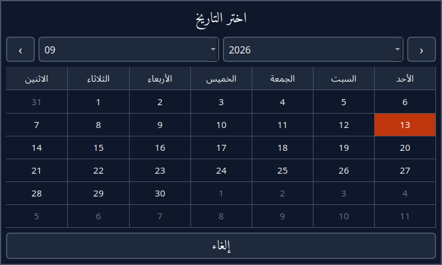</p>

في النافذة قائمتان للشهر والسنة، وسهمان للتنقّل بين الشهور، واليوم المعروض حاليًا مميَّز
بلون. اضغط على أي يوم لعرض مواقيته، أو **إلغاء** للخروج دون تغيير.

يعود الجدول إلى **يوم اليوم** تلقائيًا بعد **١٠ دقائق**، أو فورًا عند الضغط على زر
**اليوم**. وإذا بقيت الشاشة مفتوحة حتى منتصف الليل فإنها تنتقل إلى اليوم الجديد وحدها.

> زر **اليوم** لا يظهر إلا أثناء استعراض تاريخ آخر، فوجوده وحده يدلّ على أنك لست في يوم
> اليوم. وكذلك الشارة العلوية: لا تظهر إلا في يوم اليوم، لأن «ما بقي من الوقت الحالي» لا
> معنى له في يوم آخر.

### الجدول في ألوانه الأربعة

**أخضر — الوقت الفضيل**

<p align="center">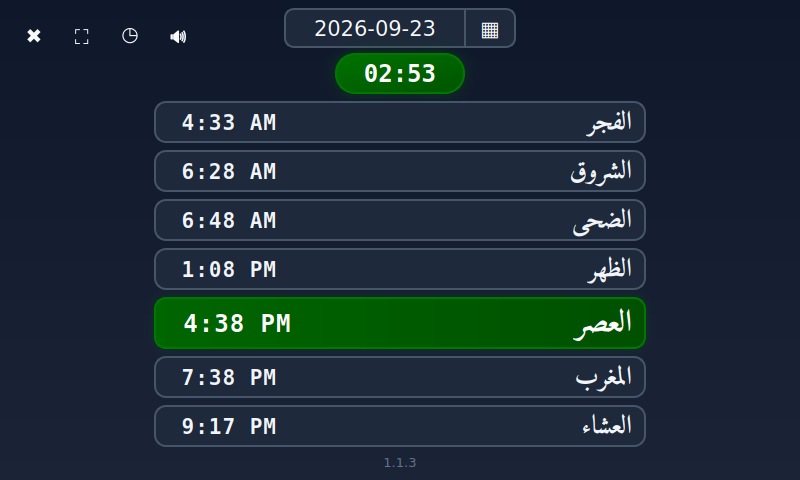</p>

بطاقة **العصر** خضراء لأن أذانه رُفع قبل **سبع دقائق**، والشارة في الأعلى خضراء مثلها
وتقول إنه بقي **ساعتان و٥٣ دقيقة** على أذان المغرب.

**بيج — باقي الوقت**

<p align="center">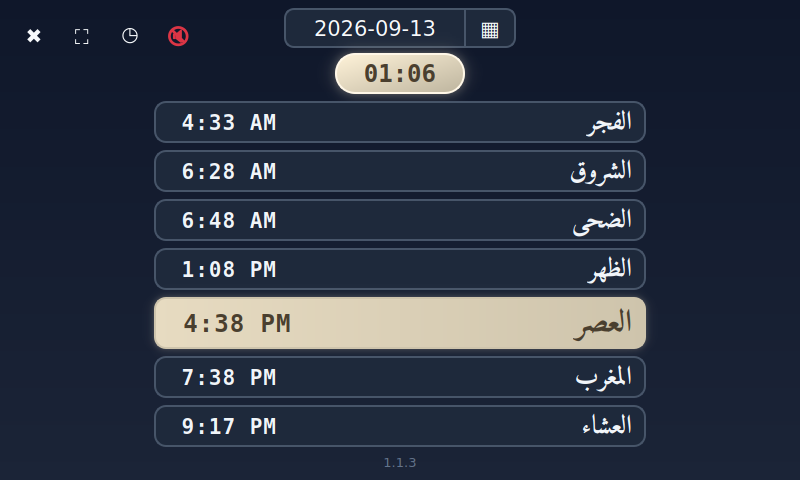</p>

بطاقة **العصر** بيج، والشارة تقول إنه بقي **ساعة وست دقائق** على انتهاء وقت العصر. (وفي
هذه الصورة الصوت مكتوم، ولذلك تظهر أيقونة الكتم حمراء — انظر **كتم الصوت** أدناه.)

**أحمر — الوقت المكروه لصلاة الفريضة**

<p align="center">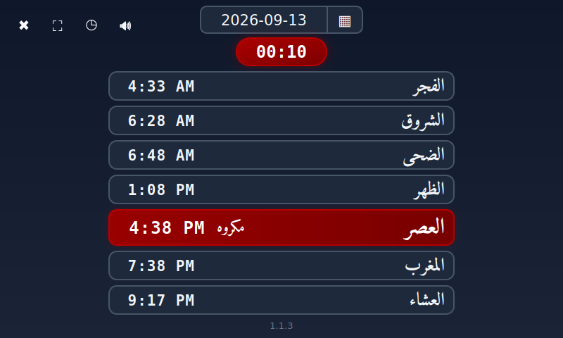</p>

بطاقة **العصر** حمراء وبقيت **عشر دقائق** على أذان المغرب. واللون الأحمر يدلّ على كراهة
تأخير **الفريضة** إلى هذا الوقت، وكلمة **مكروه** بجانبه تدلّ على أن **النافلة** مكروهة فيه
أيضًا — وهو الوقت الوحيد الذي تجتمع فيه الكراهتان.

**برتقالي — الوقت المكروه لصلاة النافلة**

<p align="center">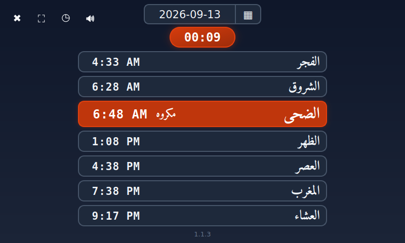</p>

بطاقة **الضحى** برتقالية وبجانبها كلمة **مكروه**: نحن في آخر وقت الضحى — أي **الزوال** —
وقد بقيت **تسع دقائق** على أذان الظهر.

> ولوقت **الشروق** بطاقة مستقلة تأخذ اللون البرتقالي بدورها في العشرين دقيقة التي تليه،
> حتى يدخل وقت الضحى.

## 3. من الشروق إلى الظهر

تمرّ الفترة الممتدة من **الشروق** حتى **الظهر** بأربع مراحل، والشاشتان تتفقان عليها:
العشرون دقيقة الأولى باسم **الشروق**، وما بعدها وقت **الضحى** حتى أذان الظهر.

**١) أول ٢٠ دقيقة بعد الشروق — مكروه للنافلة**

خلفية برتقالية، ويظهر الاسم **الشروق** مع تنبيه **(الوقت مكروه لصلاة النافلة)**، ويعدّ
الوقت المتبقي حتى دخول وقت الضحى.

<p align="center"></p>

**٢) أول ٢٠ دقيقة من الضحى — الوقت الفضيل**

خلفية خضراء، ويظهر **صلاة الضحى**، ويبدأ العدّ حتى أذان الظهر.

<p align="center"></p>

**٣) باقي وقت الضحى**

خلفية رمادية، ويستمر العدّ حتى أذان الظهر.

**٤) آخر ٢٠ دقيقة قبل الظهر — الزوال، مكروه للنافلة**

خلفية برتقالية مع تنبيه **(الوقت مكروه لصلاة النافلة)**، لأن الزوال وقت مكروه لأداء
النافلة.

<p align="center">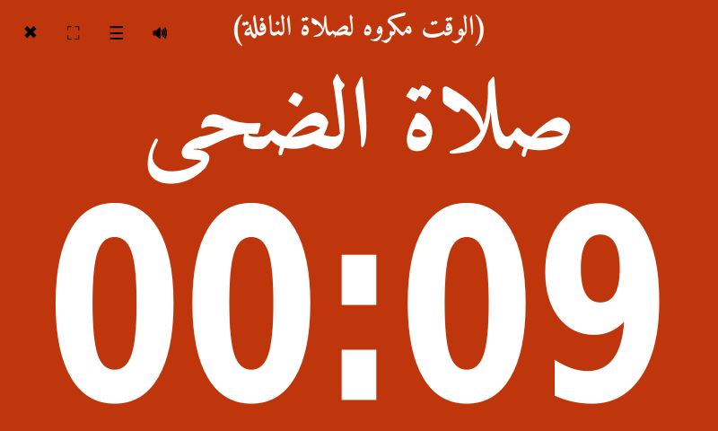</p>

## 4. آخر ٢٠ دقيقة من وقت العصر — الكراهتان معًا

هذا هو الوقت الوحيد في اليوم الذي تجتمع فيه الكراهتان:

- مكروه **لصلاة الفريضة**، لأن أذان المغرب صار على وشك الدخول — ولذلك تبقى الخلفية
  **حمراء** هنا، خلافًا للوقتين المكروهين الآخرين،
- ومكروه **لصلاة النافلة** أيضًا — ولذلك يظهر التنبيه **(الوقت مكروه لصلاة النافلة)** في
  أعلى الشاشة.

<p align="center">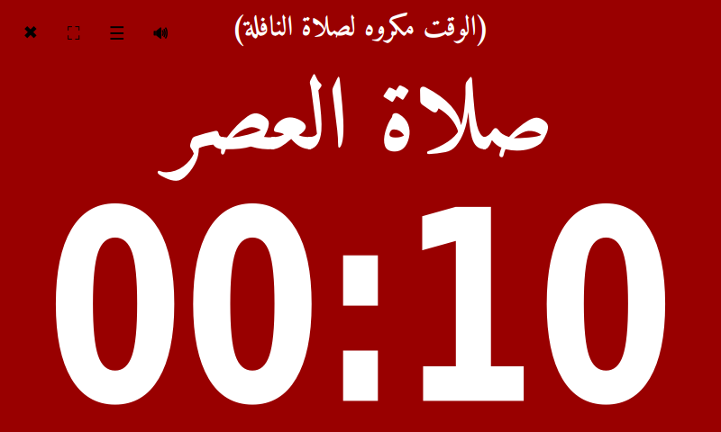</p>

وكذلك في **جدول مواقيت اليوم**: تبقى بطاقة **العصر** **حمراء**، وتظهر كلمة **مكروه**
بجانب الوقت. الشاشتان تتفقان على اللون.

<p align="center"></p>

## 5. كتم الصوت

اضغط على **🔊** لإيقاف كل ما هو مجدول من أذان وأذكار وقراءة قرآن. تتحول الأيقونة إلى
**🔇** باللون الأحمر، ويتوقف فورًا أي صوت قيد التشغيل.

<p align="center"></p>

> **ملاحظة:** يُلغى الكتم **تلقائيًا بعد ساعة واحدة**، أو فورًا عند الضغط على الأيقونة
> مرة أخرى. ويظل الكتم ساريًا — وينتهي في موعده — حتى لو أُغلق التطبيق أثناء تفعيله.

---

# ثانيًا: تطبيق الإعدادات

## 1. ملف مواقيت الصلاة الحالي

### الملفان الموجودان على سطح المكتب

على سطح المكتب ملفان بأسماء عربية، ولكلٍّ منهما دور مختلف:

| الملف | دوره |
|---|---|
| **`إدخال-مواقيت-الصلاة-للمستخدم.csv`** | **الملف المرجعي** — هو الذي تضع فيه مواقيتك، وهو الذي يُستبدل عند اختيار مصدر جديد |
| **`اوقات-الصلاة-المستخدمةبالتطبيقات.csv`** | **الملف الناتج** — يُولّده النظام من الملف المرجعي عند كل حفظ، وهو الذي تقرأ منه التطبيقات فعليًا |

> لا تُعدِّل الملف الناتج: فهو يُكتب من جديد في كل مرة تضغط **حفظ وتفعيل الإعدادت**،
> وأي تعديل فيه يضيع. التعديل يكون في الملف المرجعي.

### القسم في تطبيق الإعدادات

يعرض هذا القسم **الملف المرجعي** الذي تُقرأ منه مواقيت الصلاة، وتاريخ آخر تحديث له،
والمصدر الذي اختير منه.

<p align="center">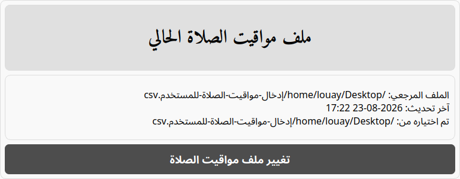</p>

اضغط **تغيير ملف مواقيت الصلاة** لاختيار مصدر آخر:

<p align="center">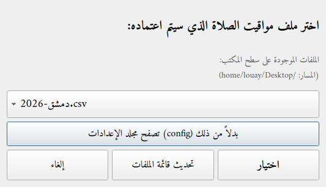</p>

| الخيار | الشرح |
|---|---|
| الملفات الموجودة على سطح المكتب | تشمل ملفات **الأوائل** المصدَّرة، وهي كل ملف ينتهي اسمه بـ `-<السنة>.csv` مثل `دمشق-2026.csv`، وتُحوَّل تلقائيًا عند اختيارها |
| تصفح مجلد الإعدادات | ملفات مدن جاهزة داخل `config/prayers-config/`، بأسماء عربية مثل `دمشق.csv` و`برلين.csv` و`آخن.csv` |
| تحديث قائمة الملفات | إعادة البحث بعد نسخ ملف جديد إلى سطح المكتب |

> اسم ملف الأوائل حرّ، عربيًّا كان أو إنجليزيًّا، والمهم أن ينتهي بـ `-<السنة>.csv`.

> **تنبيه:** اختيار مصدر جديد **يستبدل** الملف المرجعي. وإذا كان الملف يحتمل أنه عُدّل
> يدويًا، يطلب التطبيق تأكيدًا قبل الاستبدال. وتُحفظ نسخة من ملف الأوائل الأصلي في
> `config/prayers-config/raw-imports/`.

## 2. التوقيت الصيفي

<p align="center">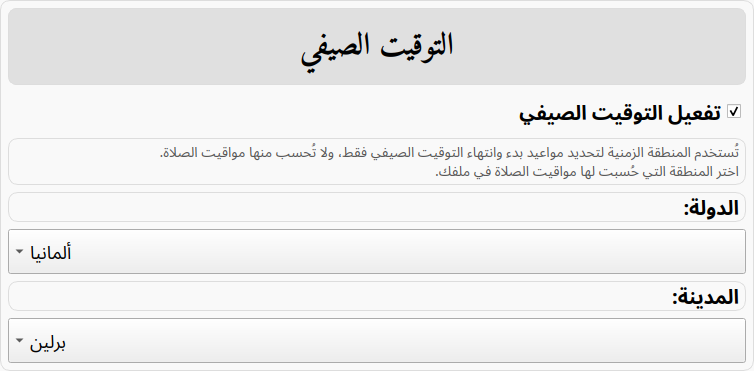</p>

| الخيار | الشرح |
|---|---|
| **تفعيل التوقيت الصيفي** | غير مفعّل افتراضيًا، وهو المناسب للمناطق التي لا تعمل بالتوقيت الصيفي مثل سوريا والسعودية |
| **الدولة / المدينة** | تُستخدم لتحديد **مواعيد بدء وانتهاء** التوقيت الصيفي فقط |

> **مهم:** لا تُحسب مواقيت الصلاة من المنطقة الزمنية إطلاقًا — فهي تأتي دائمًا من ملفك.
> اختر المنطقة التي حُسبت لها المواقيت في ملفك.

عند التفعيل يقارن التطبيق التغييرات الموجودة في ملفك بما تقتضيه المنطقة المختارة فعليًا
لهذه السنة، ويصحّحها عند الحاجة دون المساس بملفك الأصلي. ويُعاد ذلك تلقائيًا في أول يناير
من كل سنة.

## 3. تحديثات البرنامج

يتولّى هذا القسم إصدار البرنامج المثبَّت على الجهاز. وهو موجود على شاشة الجهاز فقط، ولا
يظهر في صفحة الإعدادات على الهاتف.

في أعلى القسم يظهر **الإصدار المثبَّت**، ونتيجة آخر فحص أو آخر عملية مع تاريخها، مثل
«آخر فحص: البرنامج محدَّث» أو «آخر عملية: تم التحديث بنجاح».

| الخيار | الشرح | الافتراضي |
|---|---|---|
| **تحديث تلقائي يومي** | يبحث الجهاز عن إصدار جديد مرة كل يوم في الساعة **2:00 صباحًا** ويثبّته وحده | مفعّل |
| **التحديث إلى أحدث إصدار** | التحديث فورًا إلى الإصدار المعتمد لهذا النوع من الأجهزة | — |

> **أحدث إصدار** هنا هو الإصدار المعتمد لهذه الأجهزة، وليس بالضرورة آخر ما نُشر.

وما دامت الخانة محددة يظهر تحتها سطر رمادي يذكر موعد الفحص اليومي، مثل **يُفحص عن تحديث
ويُثبَّت يوميًا الساعة 2:00 AM**.

عند إلغاء تحديد **تحديث تلقائي يومي** تظهر تحته عبارة باللون الأحمر: **التحديث التلقائي
متوقف — الجهاز ثابت على الإصدار …، ولن يُحدَّث تلقائيًا حتى تفعيل «تحديث تلقائي يومي»**.
وهذه هي الطريقة الوحيدة لإبقاء الجهاز على إصداره، وتحديد الخانة من جديد يعيده إلى التحديث
التلقائي. فإن لم يكن الإصدار المثبَّت هو أحدث إصدار، تظهر نافذة تذكر أن الجهاز سيُنقل الآن
إلى أحدث إصدار وتسأل: **هل تريد المتابعة؟** فإن اخترت **نعم** فُعِّل التحديث التلقائي وبدأ
الانتقال فورًا، وإن اخترت **لا** بقيت الخانة غير محددة.

### التثبيت على إصدار محدد

عند فتح القائمة يجلب الجهاز الإصدارات المنشورة من الإنترنت، وقد يستغرق ذلك ثوانيَ قليلة.
اختر إصدارًا من القائمة ثم اضغط **تثبيت الإصدار المحدد**.

> إن لم يكن الإصدار المختار أحدث إصدار معتمد، تظهر نافذة تسأل: **هل تريد المتابعة؟**
> لأن تثبيته يوقف **تحديث تلقائي يومي** ويُبقي الجهاز ثابتًا على هذا الإصدار. فإن اخترت
> **نعم** ثُبِّت الإصدار وأُلغي تحديد الخانة، وإن اخترت **لا** لم يتغيّر شيء.

### الرجوع إلى إصدار سابق

اختر إصدارًا من القائمة ثم اضغط الزر — ويتغيّر نصّه ليذكر الإصدار المختار، مثل **الرجوع
إلى الإصدار 1.2.1**.

أول خيار في القائمة مكتوب بجانبه **«نسخة محفوظة»**، وهو الإصدار الذي كان يعمل قبل آخر
تحديث. وهو الخيار الوحيد الذي يُستعاد من الجهاز نفسه دون إنترنت. وما دونه إصدارات أقدم
تُنزَّل من الشبكة، وتُجلب عند فتح القائمة، فلا تظهر إن لم يكن الجهاز متصلًا بالإنترنت. ولا يُحتفظ إلا بنسخة محفوظة
واحدة، فكل تحديث جديد يستبدل التي قبله.

> الرجوع إلى إصدار سابق يسأل أولًا بالنافذة نفسها، لأنه يوقف **تحديث تلقائي يومي** أيضًا،
> وإلا أعاد الفحص التالي الجهاز إلى الإصدار الذي رجعت عنه.

### تنبيه «يحتاج إلى إكمال يدوي»

قد تظهر في هذا القسم لافتة صفراء نصّها **هذا التحديث يحتاج إلى إكمال يدوي — افتح أيقونة
«تثبيت مكونات النظام» من سطح المكتب**. ومعناها أن التحديث نزل وطُبِّق، لكن بقي منه جزء
يحتاج صلاحيات النظام. وهي الأيقونة الثالثة في **الأيقونات على سطح المكتب** في أول الدليل.

## 4. ضبط الأذان والأذكار

لكل صلاة قسم مستقل بالخيارات نفسها:

<p align="center">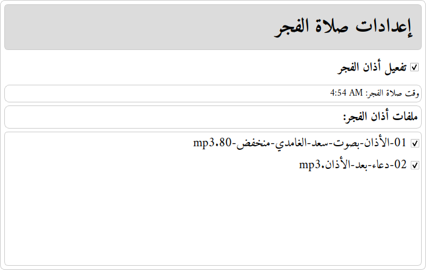</p>

| الخيار | الشرح |
|---|---|
| **تفعيل أذان …** | تشغيل أو إيقاف الأذان لهذه الصلاة |
| **وقت صلاة …** | وقت الصلاة اليوم (للعرض فقط) |
| **ملفات أذان …** | اختيار الملفات الصوتية التي ستُشغَّل |

> إن لم تُحدَّد أي ملفات، تُشغَّل **جميع** الملفات الموجودة في مجلد الصلاة.

الصلوات المتاحة: **الفجر، الشروق، الظهر، العصر، المغرب، العشاء**.

### تنبيه الشروق

الشروق ليس صلاة ولا أذان له، لذا يظهر باسم **تنبيه**، ويمكن تشغيله أو إيقافه مثل غيره.
ملفاته الصوتية توضع في المجلد `audio/shorooq/`.

<p align="center">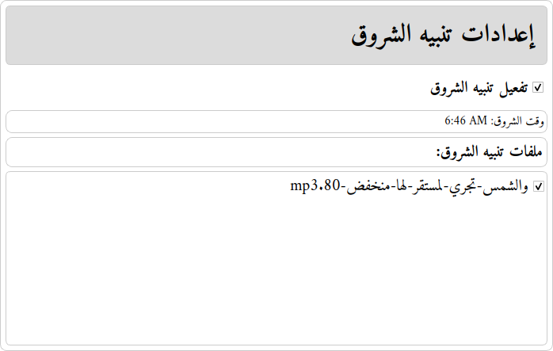</p>

### أيّ صوت يقطع الآخر

لا يُشغَّل صوتان معًا، والقاعدة واحدة في كل الأحداث:

| الحدث | إن كان هناك صوت يعمل |
|---|---|
| **أذان الفجر والظهر والعصر والمغرب والعشاء** | يقطع ما يعمل ويبدأ فورًا |
| **كل ما عداها** — تنبيه الشروق، الضحى، التهجد، الأذكار، القرآن، سورة الكهف | يُلغى هذه المرة ولا يُؤجَّل |

> لذلك قد لا تسمع أحد الأحداث غير الأذان إذا صادف وقتُه صوتًا آخر ما يزال يعمل، وهذا
> مقصود: الأذان أولى، ولا تتراكم الأصوات بعضها على بعض.

## 5. صلاة التهجد

<p align="center">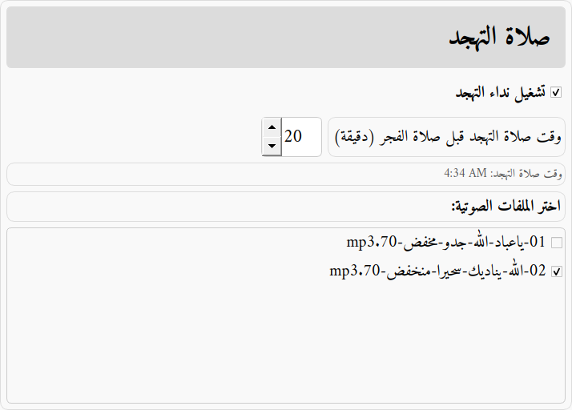</p>

| الخيار | الشرح | الافتراضي |
|---|---|---|
| **تشغيل نداء التهجد** | تفعيل النداء | مفعّل |
| **وقت صلاة التهجد قبل صلاة الفجر (دقيقة)** | عدد الدقائق قبل الفجر | ٢٠ |
| **وقت صلاة التهجد** | الوقت الناتج اليوم (للعرض فقط) | — |
| **اختر الملفات الصوتية** | ما يُشغَّل من `audio/tahajjud/` | — |

> يظهر تحت الخانة سطر رمادي فيه **الوقت الناتج اليوم**، ويتغيّر مع تغيير العدد قبل
> الحفظ، فتعرف أثره قبل أن تحفظه.

## 6. صلاة الضحى

<p align="center">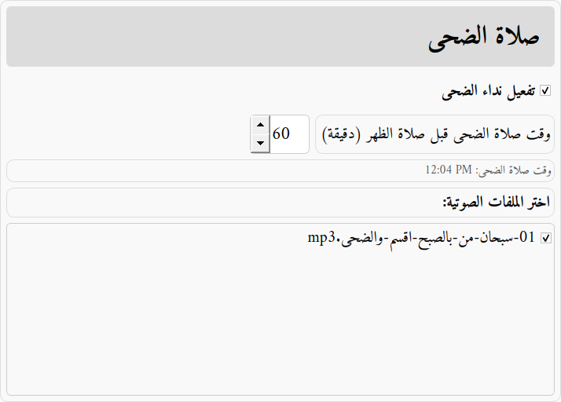</p>

| الخيار | الشرح | الافتراضي |
|---|---|---|
| **تفعيل نداء الضحى** | تفعيل النداء | مفعّل |
| **وقت صلاة الضحى قبل صلاة الظهر (دقيقة)** | عدد الدقائق قبل الظهر | ٦٠ |
| **وقت صلاة الضحى** | الوقت الناتج اليوم (للعرض فقط) | — |
| **اختر الملفات الصوتية** | ما يُشغَّل من `audio/duha/` | — |

> يظهر تحت الخانة سطر رمادي فيه **الوقت الناتج اليوم**، ويتغيّر مع تغيير العدد قبل
> الحفظ، فتعرف أثره قبل أن تحفظه.

> **تنبيه:** يرفض التطبيق أي وقت يقع في أحد الوقتين المكروهين المحيطين بالضحى:
> - قيمة **أقل من ٢٠ دقيقة** قبل الظهر، لأنها تقع في وقت الزوال،
> - أو وقتًا لا يبعد **أكثر من ٢٠ دقيقة** عن الشروق، لأن الشمس تكون ما تزال في الارتفاع.
>
> وتُرفض القيمة برسالة توضّح أيّ الحدّين تجاوزته.

## 7. أذكار الصباح

<p align="center">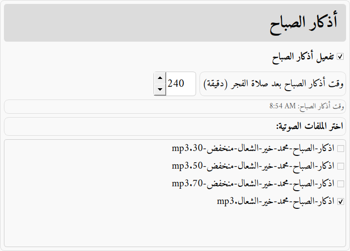</p>

| الخيار | الشرح | الافتراضي |
|---|---|---|
| **تفعيل أذكار الصباح** | تفعيل الأذكار | مفعّل |
| **وقت أذكار الصباح بعد صلاة الفجر (دقيقة)** | عدد الدقائق بعد الفجر | ٢٤٠ |
| **وقت أذكار الصباح** | الوقت الناتج اليوم (للعرض فقط) | — |
| **اختر الملفات الصوتية** | ما يُشغَّل من `audio/athkar_elsabah/` | — |

> يظهر تحت الخانة سطر رمادي فيه **الوقت الناتج اليوم**، ويتغيّر مع تغيير العدد قبل
> الحفظ، فتعرف أثره قبل أن تحفظه.

> يجب أن يقع الوقت **قبل أذان الظهر**. ولأن المدة بين الفجر والظهر تختلف على مدار السنة،
> يضبط النظام القيمة تلقائيًا في الأيام القصيرة كي لا تتجاوز الظهر.

## 8. أذكار المساء

<p align="center">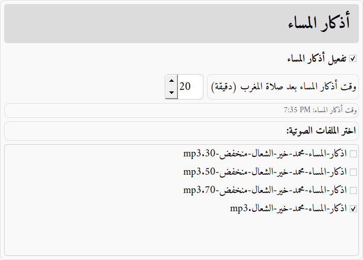</p>

| الخيار | الشرح | الافتراضي |
|---|---|---|
| **تفعيل أذكار المساء** | تفعيل الأذكار | مفعّل |
| **وقت أذكار المساء بعد صلاة المغرب (دقيقة)** | عدد الدقائق بعد المغرب | ٢٠ |
| **وقت أذكار المساء** | الوقت الناتج اليوم (للعرض فقط) | — |
| **اختر الملفات الصوتية** | ما يُشغَّل من `audio/athkar_elmasa/` | — |

> يظهر تحت الخانة سطر رمادي فيه **الوقت الناتج اليوم**، ويتغيّر مع تغيير العدد قبل
> الحفظ، فتعرف أثره قبل أن تحفظه.

## 9. قراءة سور مختارة من القرآن الكريم

<p align="center">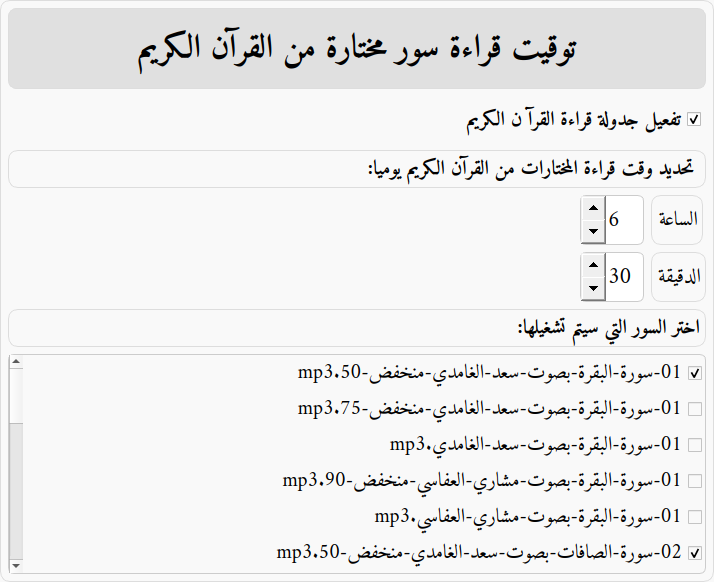</p>

| الخيار | الشرح | الافتراضي |
|---|---|---|
| **تفعيل جدولة قراءة القرآن الكريم** | تشغيل أو إيقاف القراءة اليومية | مفعّل |
| **الساعة / الدقيقة** | موعد القراءة يوميًا | ٠٦:٣٠ |
| **اختر السور التي سيتم تشغيلها** | من `audio/quran/` | — |

## 10. قراءة سورة الكهف يوم الجمعة

قسم مستقل عن القراءة اليومية: يعمل يوم الجمعة فقط، وموعده محسوب بالنسبة لصلاة الجمعة
(أي صلاة الظهر من ذلك اليوم).

| الخيار | الشرح | الافتراضي |
|---|---|---|
| **تفعيل قراءة سورة الكهف يوم الجمعة** | تشغيل أو إيقاف القراءة الأسبوعية | مفعّل |
| **موعد القراءة** | **بعد صلاة الجمعة** أو **قبل صلاة الجمعة** | بعد |
| **عدد الدقائق بالنسبة لصلاة الجمعة (دقيقة)** | البعد عن وقت الظهر | ٦٠ |
| **اختر الملفات الصوتية** | من `audio/friday_quran/` | — |

يظهر تحت الخيارات وقت القراءة في الجمعة القادمة بحسب مواقيت ذلك اليوم نفسه.

> يضبط النظام الوقت تلقائيًا كي يقع دائمًا بين الشروق والعصر: الفارق بين الظهر والعصر
> في الشتاء أقصر منه في الصيف بنحو ساعتين، فقيمة مريحة صيفًا قد تصطدم بأذان العصر شتاءً،
> وعندها تظهر ملاحظة **(تم تعديله ليقع بين الشروق والعصر)** بجانب الوقت.

> مجلد `audio/friday_quran/` يُنشأ فارغًا عند التحديث، لذا انسخ إليه ملف سورة الكهف ثم
> **أغلق تطبيق الإعدادات وافتحه من جديد** ليظهر الملف في القائمة.

## 11. حفظ الإعدادات

<p align="center">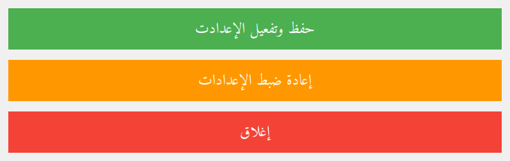</p>

| الزر | الوظيفة |
|---|---|
| **حفظ وتفعيل الإعدادت** | حفظ التغييرات وإعادة بناء جدول المواقيت وتشغيله |
| **إعادة ضبط الإعدادات** | العودة إلى الإعدادات الافتراضية |
| **إغلاق** | إغلاق التطبيق دون حفظ |

> **مهم:** لا تُطبَّق أي تغييرات قبل الضغط على **حفظ وتفعيل الإعدادت**. وقد تستغرق
> العملية بضع ثوانٍ، ويُظهر التطبيق رسالة نجاح أو رسالة خطأ واضحة عند الفشل.

---

# ثالثًا: من الهاتف عبر شبكة الواي فاي

الشاشات الثلاث نفسها متاحة أيضًا كموقع على الشبكة المحلية، فيمكن الاطّلاع على مواقيت
الصلاة أو تغيير الإعدادات من الهاتف دون الذهاب إلى الجهاز.

افتح المتصفّح على أي هاتف أو حاسوب متصل بنفس شبكة الواي فاي، واكتب:

```
http://hostname.local
```

مع استبدال `hostname` باسم الجهاز المكتوب على الملصق الموجود أسفل الجهاز. تظهر صفحة فيها ثلاثة روابط:

| الرابط | ما يعرضه |
|---|---|
| **الوقت المتبقي للصلاة** | الوقت الذي نحن فيه وما بقي على الأذان التالي، بالألوان نفسها التي تظهر على شاشة الجهاز، ومعه زر كتم الصوت |
| **اوقات الصلاة** | جدول مواقيت اليوم بالألوان نفسها، ومعه عدّاد الوقت المتبقّي من الوقت الحالي، ورقم الإصدار في أسفل الصفحة، ويمكن اختيار أي تاريخ آخر |
| **الاعدادات** | الإعدادات نفسها الموجودة في تطبيق الإعدادات على الجهاز |

<p align="center">

&nbsp;
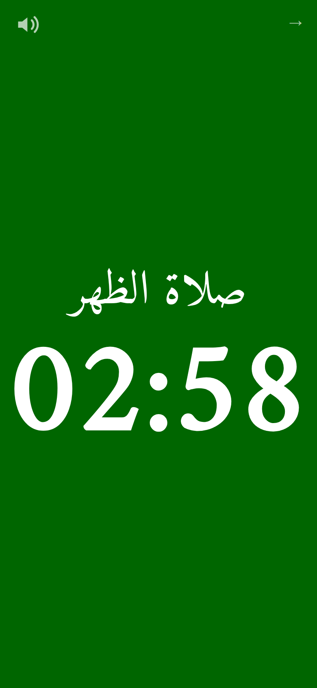
</p>
<p align="center">
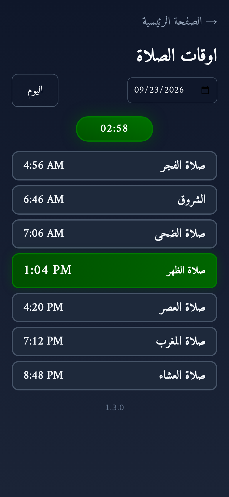
&nbsp;
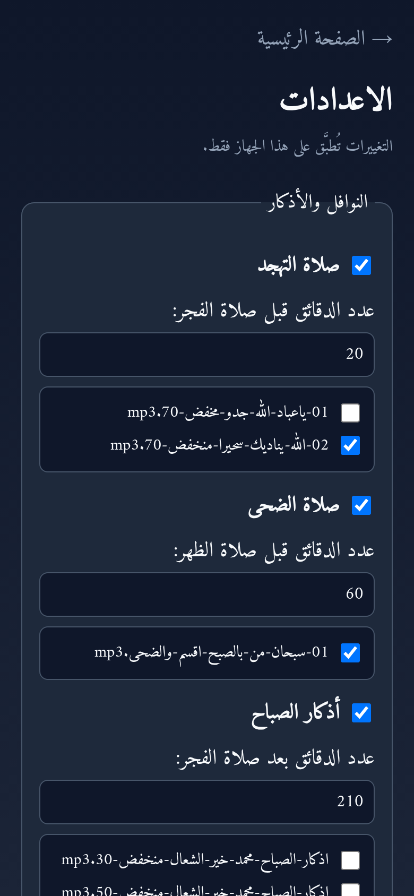
</p>

الصفحة الرئيسية، ثم **الوقت المتبقي للصلاة**، ثم **اوقات الصلاة**، ثم **الاعدادات**.

## إضافة الموقع إلى الشاشة الرئيسية

يمكن إضافة الصفحة إلى الشاشة الرئيسية في الهاتف، فتظهر بأيقونة التطبيق نفسها التي تظهر
على شاشة الجهاز. على iPhone تُفتح كأنها تطبيق مستقل، وعلى أندرويد تُفتح داخل Chrome.

### على iPhone (متصفّح Safari)

1. افتح **Safari** واكتب العنوان `http://hostname.local`.
2. اضغط زر **المشاركة** (مربّع يخرج منه سهم) في أسفل الشاشة.
3. اختر **إضافة إلى الشاشة الرئيسية** من القائمة، وقد تحتاج إلى السحب للأسفل حتى يظهر.
4. اضغط **إضافة** في أعلى الشاشة.

<p align="center">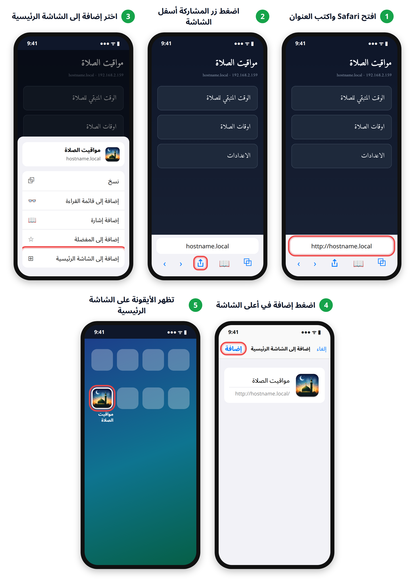</p>

> هذه الصور توضيحية، وقد تختلف أسماء الأزرار وأماكنها قليلًا حسب إصدار iPhone.

### على أندرويد (متصفّح Chrome)

1. افتح **Chrome** واكتب العنوان `http://hostname.local`.
2. اضغط زر القائمة **⋮** في أعلى الشاشة، ثم اختر **Install and create shortcut**.
3. اختر **Create shortcut**. يظهر بجانب **Install** أن التطبيق لا يمكن تثبيته، وهذا طبيعي.
4. اضغط **Add**، ثم اضغط **Add** مرة أخرى في النافذة التالية.

<p align="center">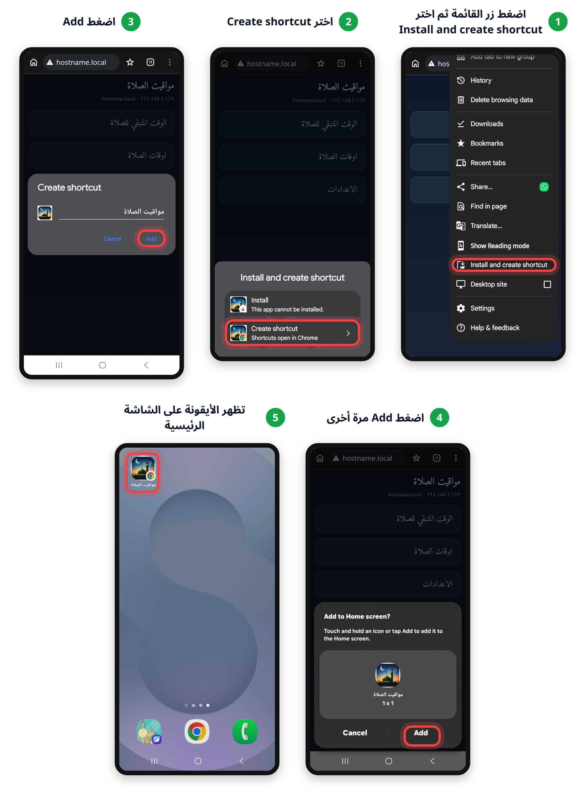</p>

تظهر الأيقونة على الشاشة الرئيسية وعليها شعار Chrome صغير، وتُفتح الصفحة داخل متصفّح
Chrome. وإن كانت لغة الهاتف العربية ظهرت أسماء الأزرار بالعربية.

**إذا لم يفتح العنوان `hostname.local`**، فالسبب غالبًا في طريقة ترجمة الاسم داخل الشبكة
أو في الهاتف نفسه (كبعض هواتف أندرويد القديمة)، وليس في الجهاز. الحل هو استعمال عنوان
الجهاز الرقمي (IP) بدل الاسم، مثل `http://192.168.2.159`. ولمعرفة هذا العنوان:

- افتح الموقع من جهاز آخر يفتح فيه الاسم، كهاتف iPhone أو حاسوب: العنوان الرقمي معروض
  في أعلى الصفحة الرئيسية للموقع، بجانب `hostname.local`.
- أو افتح صفحة إعدادات الراوتر وابحث في قائمة الأجهزة المتصلة عن اسم الجهاز.

> قد يتغير العنوان الرقمي أحيانًا، فإن توقف عن العمل فابحث عنه من جديد بالطريقة نفسها.

## الحفظ من الهاتف

الحفظ من المتصفّح يعمل تمامًا كالحفظ من تطبيق الإعدادات: تُطبَّق الإعدادات بالطريقة
نفسها، وتُرفض القيم غير الصالحة بالرسائل نفسها. وتظهر التغييرات على شاشة الجهاز من تلقاء
نفسها دون الحاجة إلى إعادة تشغيل أي تطبيق.

عند الضغط على **حفظ وتطبيق الإعدادات** تظهر شاشة انتظار مع مؤشّر دوّار، لأن التطبيق يستغرق
بضع ثوانٍ. وعند انتهائه تختفي شاشة الانتظار وتنتقل الصفحة إلى أعلاها لعرض النتيجة: رسالة
نجاح، أو رسالة الخطأ إن لم يكتمل.

## كتم الصوت من الهاتف

زر **كتم الصوت** في صفحة العد التنازلي هو الزر نفسه الموجود على شاشة الجهاز: يكتم الصوت
لمدة ساعة، ويُلغى الكتم بالضغط عليه مرة أخرى. والكتم من الهاتف يظهر على شاشة الجهاز، كما
أن الكتم من الجهاز يظهر في الهاتف.

## تفعيل الموقع لأول مرة

عند وصول تحديث يحتاج إلى صلاحيات النظام — كالتحديث الذي أضاف الموقع — يظهر في قسم
**تحديثات البرنامج** تنبيه بأن التحديث يحتاج إلى إكمال يدوي. لإكماله افتح أيقونة **تثبيت
مكونات النظام** من سطح المكتب على شاشة الجهاز، ثم انتظر حتى تظهر نافذة **تم تثبيت مكونات
النظام بنجاح** واضغط **حسناً**.

لا تُفتح نافذة سطر أوامر ولا تُطلب كلمة مرور، والعملية تستغرق ثوانٍ.

وإن لم يكتمل التثبيت ظهرت نافذة **لم يكتمل التثبيت** مع رمز الخطأ وطلب تصوير النافذة
وإرسالها للدعم الفني.

بعدها يصبح الموقع متاحًا مباشرةً على `http://hostname.local`، ولا حاجة لتكرار هذه
الخطوة بعد ذلك.

## ملاحظات

- **لا توجد كلمة مرور.** أي شخص متصل بشبكة الواي فاي يستطيع تغيير إعدادات هذا الجهاز،
  تمامًا كما يستطيع ذلك أي شخص يقف أمام شاشته. والموقع متاح داخل الشبكة المحلية فقط،
  ولا يمكن الوصول إليه من الإنترنت.
- **تغيير ملف مواقيت الصلاة لا يتم من الهاتف.** اختيار ملف المواقيت يبقى من تطبيق
  الإعدادات على شاشة الجهاز.
- **تحديثات البرنامج لا تتم من الهاتف.** قسم **تحديثات البرنامج** موجود في تطبيق
  الإعدادات على شاشة الجهاز فقط.
- إذا لم يفتح العنوان `‎.local` على هاتف أندرويد قديم، استخدم عنوان الجهاز الرقمي (IP)
  بدلًا منه — انظر **إذا لم يفتح العنوان `hostname.local`** أعلاه.

---

# رابعًا: نقل الملفات إلى الجهاز — برنامج FileZilla

الملفات الصوتية وملفات مواقيت الصلاة تُنسخ إلى الجهاز من أي حاسوب على الشبكة نفسها، دون
الحاجة إلى شاشة الجهاز ولا إلى ذاكرة `USB`.

## ما هو FileZilla

برنامج **مجاني ومفتوح المصدر**، ويعمل على **ويندوز و«ماك» ولينكس** — فأيًّا كان حاسوبك
فله نسخة منه. صفحة التحميل:

```
https://filezilla-project.org/download.php?type=client
```

> نزّل **FileZilla Client** لا **FileZilla Server**، فالأول هو المطلوب. وفي نسخة ويندوز
> يعرض المُثبِّت أحيانًا برامج إضافية لا علاقة لها بالموضوع، فارفضها واكمل التثبيت.

## بيانات الاتصال — الملصق أسفل الجهاز

على **الوجه السفلي لكل جهاز** ملصق مكتوب عليه بيانات الاتصال كاملة. اقلب الجهاز واقرأها
منه، فهي تخصّ جهازك وحده.

## إدخال البيانات

بعد فتح البرنامج يظهر في أعلى النافذة شريط **الاتصال السريع** بأربع خانات:

<p align="center">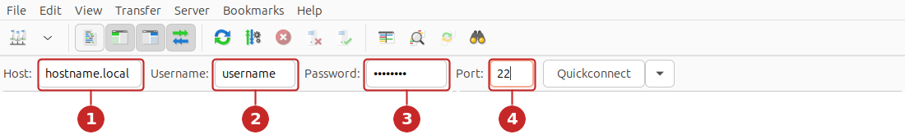</p>

| # | الخانة | ما يُكتب فيها |
|:---:|---|---|
| **1** | `Host` | اسم الجهاز متبوعًا بـ `.local`، هكذا: `hostname.local` |
| **2** | `Username` | اسم المستخدم من الملصق، وهو نفسه اسم الجهاز عادةً |
| **3** | `Password` | كلمة السر من الملصق |
| **4** | `Port` | `22` |

> كلمة **`hostname`** في الصورة وفي الجدول ليست الاسم الحقيقي، وإنما موضع يُكتب فيه
> **اسم جهازك أنت** المكتوب على الملصق أسفل الجهاز. فإن كان الاسم على الملصق `louay`
> مثلًا، فالذي يُكتب في الخانة الأولى هو `louay.local`. وكذلك **`username`** في الخانة
> الثانية.

ثم اضغط **Quickconnect**. وفي أول اتصال تظهر نافذة تسأل عن **مفتاح الجهاز** (Unknown host
key) — اضغط **OK** للموافقة، ولن تظهر مرة أخرى.

## نسخ الملفات

بعد نجاح الاتصال تنقسم النافذة نصفين: **اليسار** ملفات حاسوبك، و**اليمين** ملفات الجهاز.
افتح في الجهة اليمنى المسار:

```
Desktop/scheduler/audio/
```

ثم ادخل المجلد الموافق للحدث — انظر **ملحق: مجلدات الملفات الصوتية** في آخر الدليل —
واسحب ملفات `mp3` من اليسار إلى اليمين.

> بعد إضافة أي ملف صوتي **أغلق تطبيق الإعدادات على الجهاز ثم افتحه من جديد** حتى يظهر
> الملف في القائمة، ثم اختره واضغط **حفظ وتفعيل الإعدادت**.

وملفات مواقيت الصلاة تُنسخ إلى **سطح المكتب** مباشرة:

```
Desktop/
```

ثم تُختار من تطبيق الإعدادات — انظر **ملف مواقيت الصلاة الحالي**.

> لا تنقل ولا تحذف شيئًا آخر داخل مجلد `scheduler`، فهو ملفات البرنامج نفسه.

---

# ملحق: مجلدات الملفات الصوتية

توضع ملفات `mp3` داخل `~/Desktop/scheduler/audio/` في المجلد الموافق للحدث:

| الحدث | المجلد |
|---|---|
| الفجر | `fajr` |
| الشروق | `shorooq` |
| الضحى | `duha` |
| أذكار الصباح | `athkar_elsabah` |
| الظهر | `dhuhr` |
| العصر | `asr` |
| المغرب | `maghrib` |
| أذكار المساء | `athkar_elmasa` |
| العشاء | `isha` |
| التهجد | `tahajjud` |
| القرآن الكريم | `quran` |
| سورة الكهف (الجمعة) | `friday_quran` |

وتُنسخ الملفات إلى هذه المجلدات من الحاسوب — انظر **رابعًا: نقل الملفات إلى الجهاز**.

تُقرأ قائمة الملفات الصوتية عند فتح تطبيق الإعدادات، لذا بعد إضافة أي ملف جديد **أغلق
التطبيق ثم افتحه من جديد** حتى يظهر في القائمة، ثم اختره واضغط **حفظ وتفعيل الإعدادت**.

> زر **تحديث قائمة الملفات** يخصّ نافذة اختيار ملف مواقيت الصلاة فقط، ولا علاقة له
> بالملفات الصوتية.

</div>
