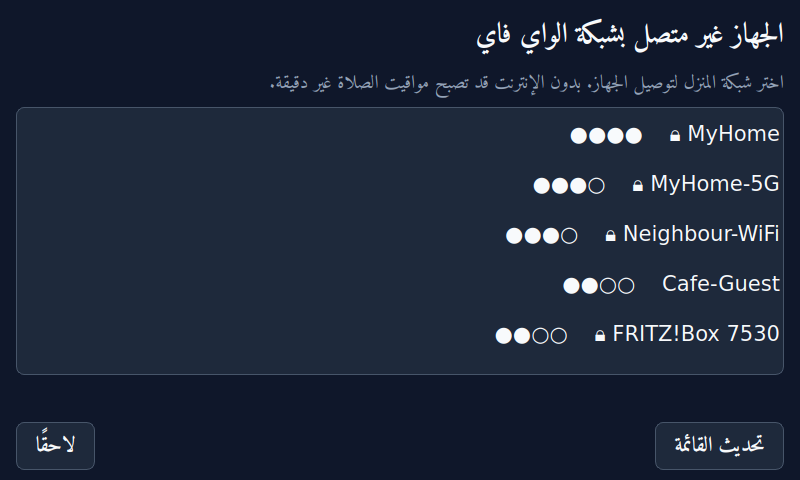
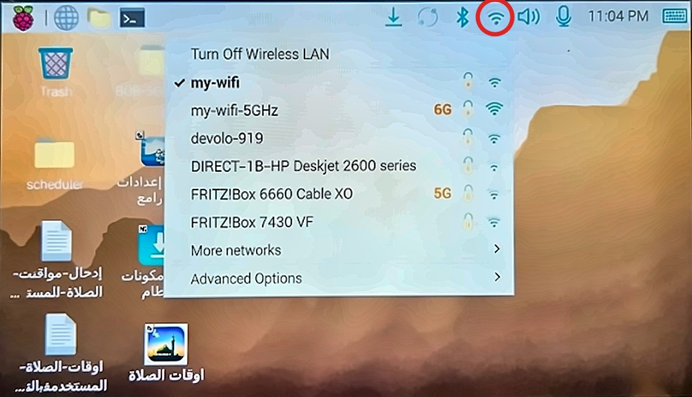
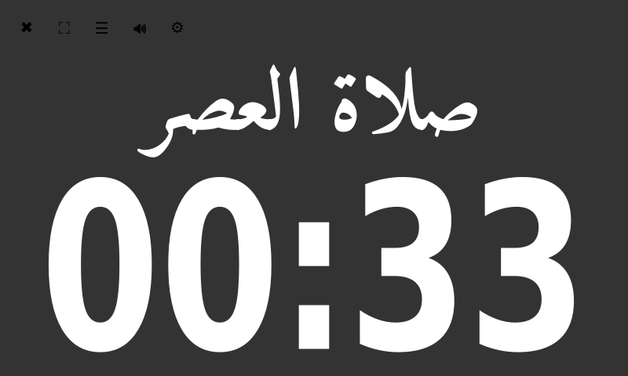
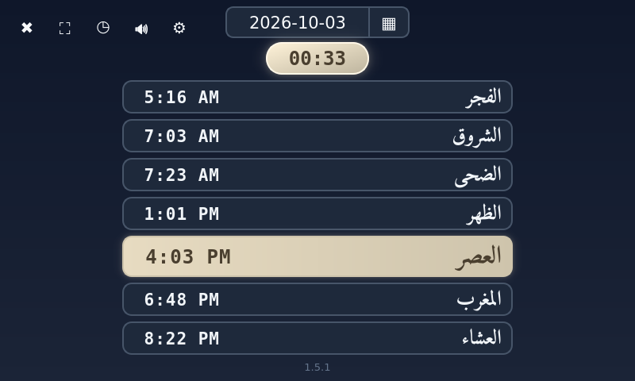
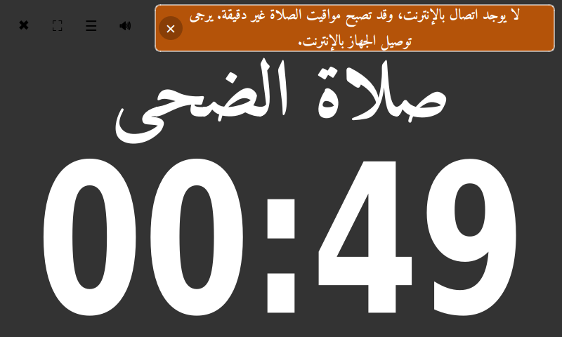
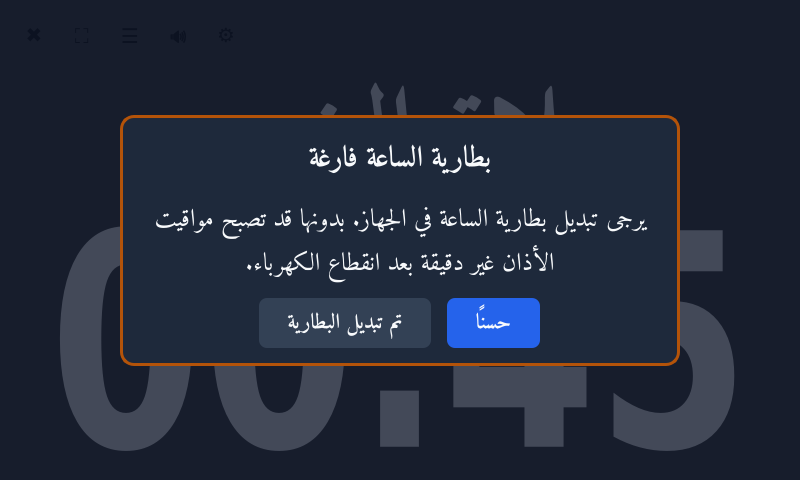
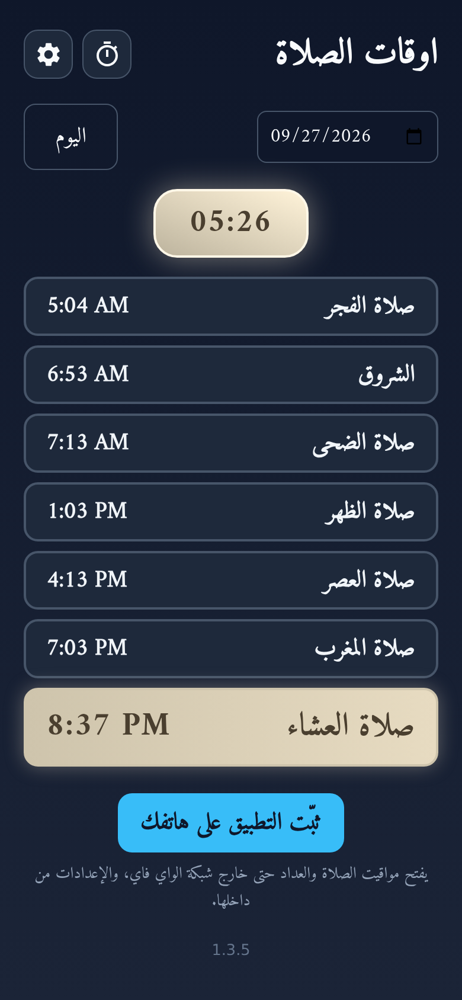
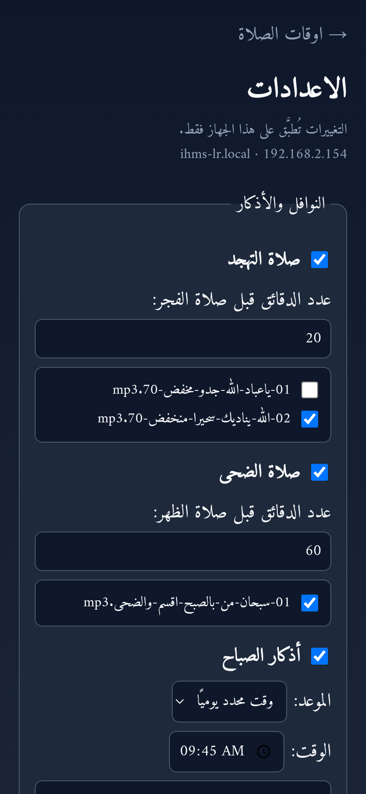
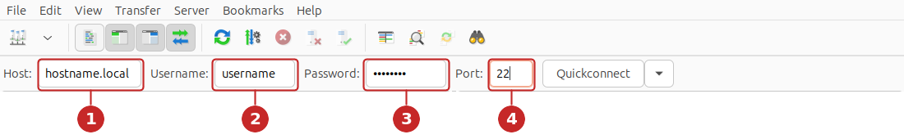
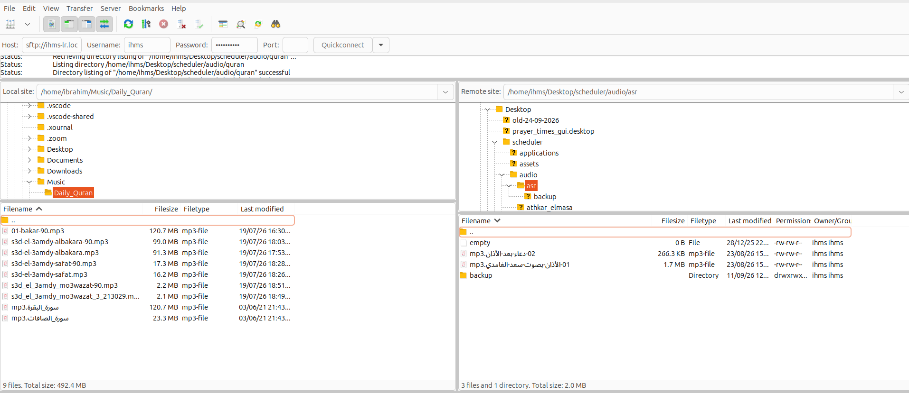

# دليل المستخدم — نظام مواقيت الصلاة والأذان

> [!WARNING]
> **خطوة مهمة جدًا: وصِّل الجهاز بشبكة الواي فاي**
>
> بعد توصيل الجهاز وسماعة البلوتوث بالكهرباء، وصِّل الجهاز بشبكة الواي فاي في المنزل. إذا
> لم يكن متصلًا تظهر على الشاشة **نافذة الاتصال بالواي فاي**: اختر شبكة المنزل، واكتب كلمة
> المرور، ثم اضغط **اتصال**.
>
> إما عن طريق البرنامج:
>
> 
>
> أو من سطح المكتب: أغلق تطبيق السكينة بالزر **✖**، واضغط **أيقونة الواي فاي** في أعلى سطح
> المكتب، واختر الشبكة، ثم افتح أيقونة **السكينة** من جديد.
>
> 

| الأيقونة على سطح المكتب | ماذا تفتح |
|---|---|
|  **السكينة** | شاشة العد التنازلي وجدول مواقيت اليوم، والإعدادات من الزر **⚙** |
|  **إعدادات السكينة** | الإعدادات مباشرة، وهي نفسها التي يفتحها الزر **⚙** |
|  **تثبيت مكونات النظام** | لا تُفتح إلا إذا طلب ذلك تحديثٌ للبرنامج |

ويمكن أيضًا عرض المواقيت وتغيير الإعدادات من الهاتف.

---

# الفهرس

- [أولاً: تطبيق السكينة](#أولاً-تطبيق-السكينة)
    - [الشاشتان والألوان](#الشاشتان-والألوان)
    - [انقطاع الإنترنت والواي فاي](#انقطاع-الإنترنت-والواي-فاي)
    - [بطارية الساعة](#بطارية-الساعة)
- [ثانيًا: تطبيق الإعدادات](#ثانيًا-تطبيق-الإعدادات)
    - [ملف مواقيت الصلاة والتوقيت الصيفي](#ملف-مواقيت-الصلاة-والتوقيت-الصيفي)
    - [تحديثات البرنامج](#تحديثات-البرنامج)
    - [الحفظ وإعادة الضبط](#الحفظ-وإعادة-الضبط)
    - [الأذان والنوافل والأذكار والقرآن](#الأذان-والنوافل-والأذكار-والقرآن)
- [ثالثًا: من الهاتف](#ثالثًا-من-الهاتف)
    - [داخل المنزل: موقع الجهاز](#داخل-المنزل-موقع-الجهاز)
    - [تثبيت التطبيق على الهاتف — يعمل خارج المنزل أيضًا](#تثبيت-التطبيق-على-الهاتف--يعمل-خارج-المنزل-أيضًا)
- [رابعًا: (اختياريًا) إضافة ملفات صوت إلى الجهاز (أذان، قرآن كريم) عن طريق تطبيق FileZilla](#رابعًا-اختياريًا-إضافة-ملفات-صوت-إلى-الجهاز-أذان-قرآن-كريم-عن-طريق-تطبيق-filezilla)

---

# أولاً: تطبيق السكينة

## الشاشتان والألوان

&nbsp;

| الزر | الوظيفة |
|---|---|
| ✖ | إغلاق التطبيق |
| ⛶ | تكبير / تصغير الشاشة |
| ☰ / ◷ | التنقّل بين العدّاد والجدول |
| 🔊 / 🔇 | كتم كل الأصوات المجدولة وإيقاف ما يعمل الآن. يُلغى الكتم بعد ساعة، أو بالضغط مرة أخرى |
| ⚙ | فتح الإعدادات، وإغلاقها يعيد إلى هذه الشاشة |

اللون معناه واحد في الشاشتين: خلفية العدّاد، ولون بطاقة الوقت الحالي في الجدول.

| اللون | المعنى |
|---|---|
| **أخضر** | الوقت الفضيل: أول ٢٠ دقيقة بعد الأذان |
| **رمادي** (بيج في الجدول) | باقي الوقت |
| **أحمر** | مكروه **للفريضة**: آخر ٢٠ دقيقة قبل الأذان التالي |
| **برتقالي** | مكروه **للنافلة**: ٢٠ دقيقة بعد الشروق، ووقت الزوال قبل الظهر |

في الأوقات المكروهة للنافلة يظهر في أعلى العدّاد **(الوقت مكروه لصلاة النافلة)**، وبجانب
الوقت في الجدول كلمة **مكروه**. وآخر ٢٠ دقيقة من العصر مكروهة للأمرين معًا، فتبقى حمراء مع
التنبيه.

## انقطاع الإنترنت والواي فاي

يأخذ الجهاز الوقت من الإنترنت، فإذا انقطع قد تصبح مواقيت الأذان غير دقيقة، خاصةً إذا انقطعت
الكهرباء أثناء ذلك.

- **تنبيه برتقالي** في أعلى الشاشة: يظهر فور فتح التطبيق إذا لم يكن الجهاز متصلًا، أو بعد
  ٥ دقائق من الانقطاع. يُغلق بالزر **✕** حتى يُفتح التطبيق من جديد، وعند عودة الإنترنت
  يظهر شريط أخضر لمدة ١٠ ثوانٍ.
- **نافذة الاتصال بالواي فاي**: إذا لم يكن الجهاز متصلًا بأي شبكة (فور فتح التطبيق، أو بعد
  دقيقتين من الانقطاع). اضغط اسم الشبكة، واكتب كلمة المرور، ثم **اتصال**.

&nbsp;

## بطارية الساعة

للأجهزة التي فيها ساعة ببطارية فقط. تحفظ البطارية الوقت عند انقطاع الكهرباء، فإذا فرغت تظهر
عند فتح التطبيق نافذة **بطارية الساعة فارغة**:

- **حسنًا**: تُغلق النافذة، وتظهر من جديد عند فتح التطبيق أو إعادة تشغيل الجهاز.
- **تم تبديل البطارية**: اضغطها بعد تركيب بطارية جديدة، فلا تظهر النافذة بعدها.

> **ملاحظة:** تبديل البطارية والجهاز مطفأ يُظهر النافذة مرة واحدة حتى لو كانت البطارية الجديدة
> سليمة، فاضغط **تم تبديل البطارية**.

---

# ثانيًا: تطبيق الإعدادات

> تُفتح من الزر **⚙** في تطبيق السكينة، أو من أيقونة **إعدادات السكينة** على سطح المكتب فتُغلق بالزر **✖ إغلاق**. ولتطبيق أي تغيير يجب الضغط على **حفظ وتفعيل الإعدادت** في أسفل الصفحة.

## ملف مواقيت الصلاة والتوقيت الصيفي

**لاختيار مواقيت مدينتك:**

1. افتح **الإعدادات** واضغط **تغيير ملف مواقيت الصلاة**.
2. اختر مدينتك من القائمة، ثم اضغط **اختيار**.
3. اضغط **حفظ وتفعيل الإعدادات**.

**لتغيير وقت صلاة بنفسك:**

1. افتح ملف «**إدخال-مواقيت-الصلاة-للمستخدم**» على سطح المكتب، وعدّل الوقت.
2. افتح **الإعدادات** واضغط **حفظ وتفعيل الإعدادات**.

**للعودة إلى مواقيت المدينة الأصلية:**

1. افتح **الإعدادات** واضغط **تغيير ملف مواقيت الصلاة**.
2. اضغط **استعادة مواقيت المدينة**.
3. اضغط **حفظ وتفعيل الإعدادات**.

> **ملاحظة:** لا تعدّل ملف «**اوقات-الصلاة-المستخدمةبالتطبيقات**» على سطح المكتب، فالبرنامج يكتبه بنفسه.

**التوقيت الصيفي** يتبع **المنطقة الزمنية للجهاز** تلقائيًا، ولا يحتاج إلى أي ضبط.

## تحديثات البرنامج

يبحث الجهاز عن إصدار جديد كل يوم الساعة **٢:٠٠ صباحًا** ويثبّته، ما دامت خانة **تحديث
تلقائي يومي** محددة. وزر **التحديث إلى أحدث إصدار** يحدّثه فورًا. ويمكن من القسم نفسه تثبيت
إصدار محدد أو الرجوع إلى إصدار سابق، وذلك يوقف التحديث التلقائي — إن لم يكن الإصدار هو
الأحدث — حتى تحديد الخانة من جديد.

> نادرًا ما يحدث: إذا ظهرت لافتة **هذا التحديث يحتاج إلى إكمال يدوي**، فافتح أيقونة **تثبيت مكونات النظام**
> من سطح المكتب وانتظر رسالة **تم تثبيت مكونات النظام بنجاح**.

## الحفظ وإعادة الضبط

| الزر | الوظيفة |
|---|---|
| **حفظ وتفعيل الإعدادت** | حفظ التغييرات وتطبيقها، ويستغرق ثوانيَ قليلة |
| **إعادة ضبط الإعدادات** | العودة إلى الإعدادات الافتراضية (في الجدول التالي)، دون تغيير ملف المواقيت |
| **إغلاق** | الخروج دون حفظ |

بعد نسخ ملف صوتي جديد إلى الجهاز، **أغلق تطبيق الإعدادات وافتحه من جديد** ليظهر في القائمة.

## الأذان والنوافل والأذكار والقرآن

لكل حدث خانة تفعيل وقائمة ملفات صوتية، ويظهر تحت أغلبها وقته الناتج اليوم قبل الحفظ.

| الحدث | ما يُضبط | الافتراضي | مجلد الملفات في `audio/` |
|---|---|---|---|
| **أذان** الفجر، الظهر، العصر، المغرب، العشاء | التفعيل والملفات | مفعّل | `fajr` `dhuhr` `asr` `maghrib` `isha` |
| **تنبيه الشروق** | التفعيل والملفات | مفعّل | `shorooq` |
| **التهجد** | دقائق قبل الفجر | ٢٠ | `tahajjud` |
| **الضحى** | دقائق قبل الظهر، بين ٢٠ دقيقة بعد الشروق و٢٠ دقيقة قبل الظهر | ٦٠ | `duha` |
| **أذكار الصباح** | **وقت محدد يوميًا** أو **بعد صلاة الفجر** بعدد من الدقائق | ٩:٤٥ (أو ٢١٠ دقيقة) | `athkar_elsabah` |
| **أذكار المساء** | دقائق بعد المغرب | ٢٠ | `athkar_elmasa` |
| **القرآن الكريم** يوميًا | الساعة والدقيقة | ٧:٠٠ | `quran` |
| **سورة الكهف** يوم الجمعة | قبل صلاة الجمعة أو بعدها بعدد من الدقائق | بعدها بـ ٦٠ | `friday_quran` |

> - تُشغَّل الملفات المحدَّدة فقط. وإذا لم يُحدَّد أي ملف لحدث، يُلغى تفعيله تلقائيًا عند الحفظ.
> - الأذان يقطع أي صوت يعمل، أما بقية الأحداث فتُلغى إذا صادفت صوتًا يعمل.
> - إذا جاء أذان العشاء بعد الساعة ١٠ ليلًا، يُشغَّل الأذان بصوت منخفض (ملف أذان الفجر).

---

# ثالثًا: من الهاتف

## داخل المنزل: موقع الجهاز

على أي هاتف أو حاسوب متصل بشبكة الواي فاي نفسها افتح **`http://hostname.local`**، مع
استبدال `hostname` باسم الجهاز المكتوب على الملصق الموجود أسفل الجهاز.

تظهر **اوقات الصلاة**، وفي أعلاها أيقونة الساعة لـ **الوقت المتبقي للصلاة** (وفيها زر كتم
الصوت)، وأيقونة ⚙ لـ **الاعدادات**.

> لتغيير إعدادات الجهاز وكتم الصوت من الهاتف، يجب الاتصال بنفس شبكة الواي فاي المتصل بها
> الجهاز.

&nbsp;

&nbsp;

صفحة **الاعدادات** على الهاتف فيها كل ما في تطبيق الإعدادات على الجهاز.

> **ملاحظة:** أثناء التحديث أو رفع ملف، اترك الصفحة مفتوحة حتى تظهر النتيجة.

**إدارة الملفات الصوتية:**

- **رفع ملف:** اختر المجلد، ثم ملف MP3. حدّده في القائمة ثم اضغط **حفظ وتفعيل الإعدادات**.
- **حذف ملفات:** اختر المجلد، وحدّد الملفات، ثم اضغط **حذف الملفات المحددة**. الحذف نهائي.

**المنطقة الزمنية للجهاز** (عند نقل الجهاز إلى بلد آخر):

1. اختر الدولة (والمدينة إن ظهرت).
2. اضغط **تغيير المنطقة الزمنية وإعادة التشغيل**.
3. إن ظهرت قائمة ملفات المواقيت، اختر مدينتك أو أبقِ الملف الحالي.
4. يُعاد تشغيل الجهاز خلال ثوانٍ. إن لم تظهر القائمة، اختر ملف مواقيت مدينتك بعد ذلك.

## تثبيت التطبيق على الهاتف — يعمل خارج المنزل أيضًا

التطبيق يعرض المواقيت والعدّاد في أي مكان، حتى دون إنترنت. أما الإعدادات وكتم الصوت فتعمل
داخل شبكة الجهاز فقط. لتثبيته، مرة واحدة وأنت في المنزل:

1. افتح `http://hostname.local` واضغط **ثبّت التطبيق على هاتفك** في أسفل الصفحة.
2. **أندرويد:** اضغط **ثبّت التطبيق** ثم **تثبيت**. 
   **iPhone:** زر **المشاركة** ثم **إضافة إلى الشاشة الرئيسية** ثم **إضافة**.
3. تظهر على الشاشة الرئيسية للهاتف أيقونة **السكينة**.

> **ملاحظات:**
>
> - على iPhone تُفتح الإعدادات في نافذة Safari فوق التطبيق، ويُعاد إلى التطبيق بالزر **✕**.
> - إذا قام المستخدم بتغيير المدينة من القائمة التي تظهر له بتطبيق الهاتف، فهذا لا يعني تغيير
>   وقت المدينة المعروضة على الجهاز.

---

# رابعًا: (اختياريًا) إضافة ملفات صوت إلى الجهاز (أذان، قرآن كريم) عن طريق تطبيق FileZilla

جهاز السكينة يتيح لك إضافة ملفات صوتية إضافية (قرآن كريم بصوت قارئ مفضل، أو أذان بصوت مؤذن
محبب) على الجهاز، ليتم اختيارها فيما بعد عن طريق تطبيق الإعدادات.

> **ملاحظة:** البرنامج لا يدعم إلا ملفات الصوت بصيغة MP3.

للتحكم برفع ملفات الصوت، يجب تنصيب برنامج **FileZilla Client**:

1. حمّل التطبيق على جهازك الحاسوب (متوفر مجانًا لأنظمة التشغيل: ويندوز وماك ولينكس) من خلال
   الرابط: `https://filezilla-project.org/download.php?type=client`
2. ثبّت التطبيق على جهازك.
3. افتح تطبيق **FileZilla Client**.
4. في شريط الاتصال السريع اكتب: **Host** `hostname.local`، و**Username** و**Password** من
   الملصق أسفل الجهاز، و**Port** `22`، ثم **Quickconnect**. ووافق على مفتاح الجهاز في أول
   اتصال.

    

5. في الجهة اليمنى (ملفات الجهاز) افتح المجلد `Desktop/scheduler/audio/`، ثم المجلد المناسب.
   ومن الجهة اليسرى (ملفات حاسوبك) اسحب ملفات `mp3` إليه، كما هو موضح في الشكل أدناه.

    

6. افتح تطبيق الإعدادات، ثم اختر ملف الصوت الجديد.

> لا تنقل ولا تحذف شيئًا آخر داخل مجلد `scheduler`.

